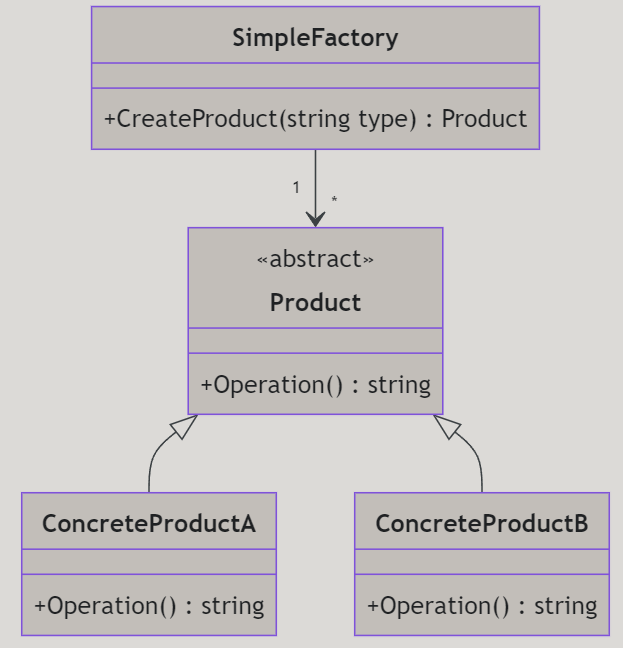
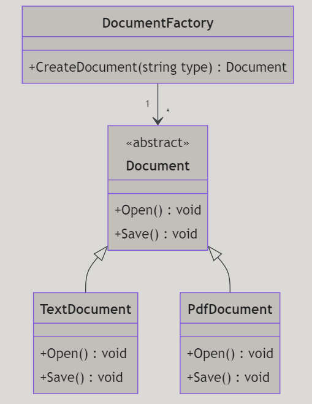
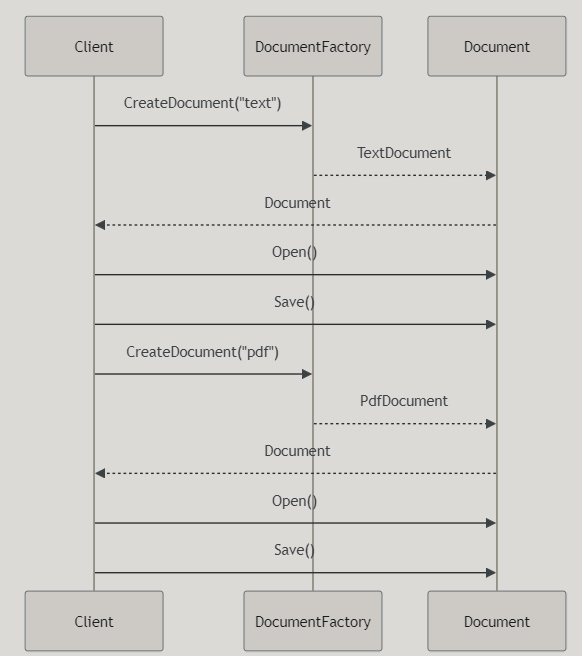

# Simple Factory Design Pattern

---

# Introduktion

I denna föreläsning ska vi gå igenom Simple Factory-mönstret, ett grundläggande designmönster inom objektorienterad programmering. Vi kommer att täcka följande områden:

- Vad är Simple Factory?
- Varför använda Simple Factory?
- Hur implementerar man Simple Factory i C#?
- Exempel på användning av Simple Factory i verkliga situationer

---

# Vad är Simple Factory?

Simple Factory är ett designmönster där en fabriksklass har en metod som returnerar objekt av olika klasser baserat på inskickade parametrar. Detta gör att man kan centralisera logiken för objektskapande.

---

# Varför använda Simple Factory?

- **Centraliserat skapande:** Samlar skapandet av objekt på ett ställe.
- **Kapsling:** Döljer logiken för objektskapande från användaren.
- **Flexibilitet:** Gör det lätt att lägga till nya typer av objekt utan att ändra klientkod.

---

# Struktur av Simple Factory

---

# Exempel på implementering

Vi ska nu gå igenom ett exempel där vi har en fabriksklass som skapar olika produkter baserat på en parameter.

---

# Användning av Simple Factory

Tänk er att vi har en applikation som ska hantera olika typer av dokument: textdokument och PDF-dokument. Vi kan använda Simple Factory för att skapa dessa dokument baserat på en parameter som skickas in.

---

---

# Sammanfattning

- **Simple Factory** är ett designmönster där en fabriksklass har en metod som returnerar objekt av olika klasser baserat på inskickade parametrar.
- Det hjälper till att centralisera objektskapande och döljer skapandelogiken från användaren.
- Simple Factory är användbart när man vill skapa objekt av olika typer utan att exponera skapandelogiken för klienten.

---

# Slutord

Genom att använda Simple Factory kan vi skapa flexibla och utbytbara lösningar i våra program. Detta designmönster är ett kraftfullt verktyg i en utvecklares verktygslåda och hjälper till att skapa robusta och underhållbara applikationer.

Och vi slipper skriva en massa new-kommandon i klientkoden! Yay!

---

# Kod

https://github.com/Campus-Molndal-CLO23/DesignPatterns/blob/main/lecture1/code/02_simple_factory.cs

https://github.com/Campus-Molndal-CLO23/DesignPatterns/blob/main/lecture1/code/02_simple_factory2.cs