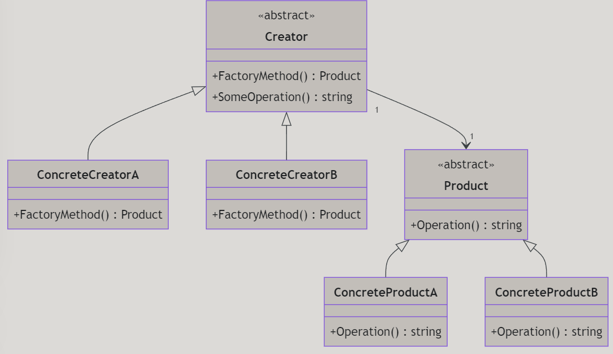
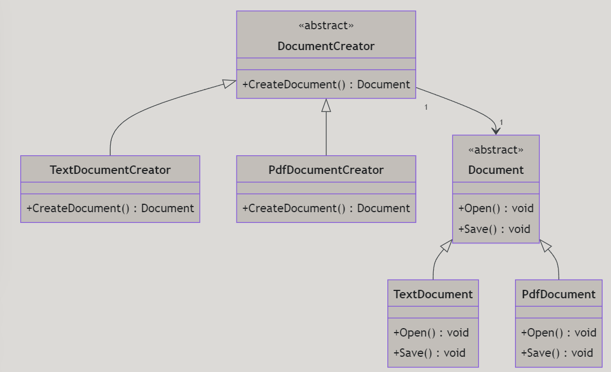
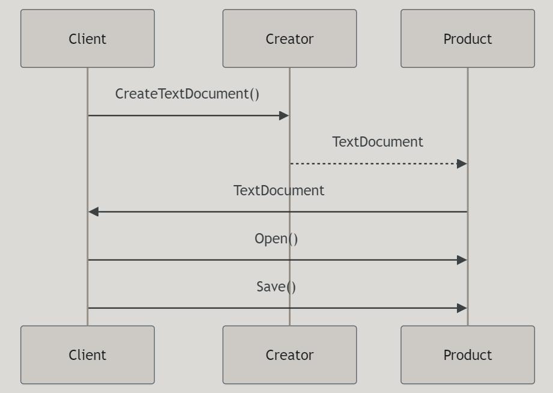

# Factory Method Design Pattern

---

# Introduktion

I denna föreläsning ska vi gå igenom Factory Method-mönstret, ett av de mest använda designmönstren inom objektorienterad programmering.

---

- Vad är Factory Method?
- Varför använda Factory Method?
- Hur implementerar man Factory Method i C#?
- Exempel på användning av Factory Method i verkliga situationer

---

# Vad är Factory Method?

Factory Method är ett designmönster som tillåter objekt att skapas utan att specificera den exakta klassen av objekt som ska skapas. Istället delegeras objektets skapande till underklasser som implementerar en fabrikmetod för att skapa objekt.

---

# Varför använda Factory Method?

- **Separation av kod:** Genom att använda Factory Method kan du separera kod som skapar objekt från kod som använder objekt.
- **Utbytbarhet:** Det gör det enkelt att byta ut objekt utan att ändra klientkod.
- **Enkelhet:** Det kan förenkla kod och göra den lättare att underhålla.

---

Grundläggande strukturen för Factory Method-mönstret.


    
---

Exempel av skapande med hjälp av Factory Method.



---

# I kod

```csharp	
var text = new TextDocument();
text.Open();
text.Save();
```

```csharp
var pdf = new PdfDocument();
pdf.Open();
pdf.Save();
```

---

Nu kan vi skapa dokument utan att direkt referera till de konkreta dokumentklasserna.




---

# Sammanfattning

- **Factory Method** är ett designmönster som tillåter skapande av objekt utan att specificera den exakta klassen.
- Det hjälper till att separera objektets skapande från dess användning, vilket gör koden lättare att underhålla och utöka.
- Genom att implementera fabrikmetoder i underklasser kan du skapa olika typer av objekt beroende på behovet utan att ändra klientkoden.

---

# Frågor?

Har ni några frågor eller något som behöver förtydligas? Tveka inte att fråga!

---

# Slutord

Genom att använda Factory Method kan vi skapa flexibla och utbytbara lösningar i våra program. Detta designmönster är ett kraftfullt verktyg i en utvecklares verktygslåda och hjälper till att skapa robusta och underhållbara applikationer.
