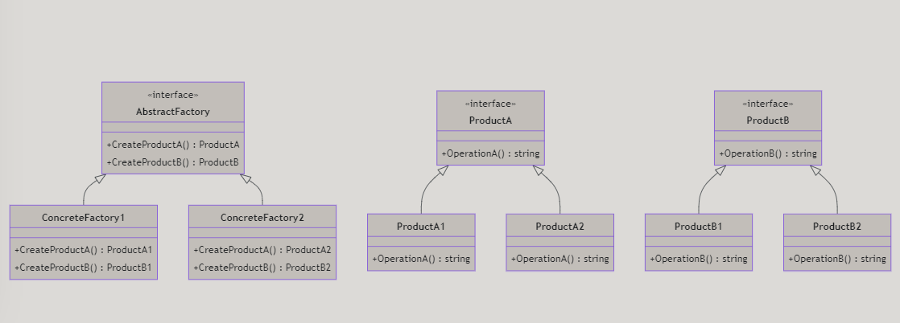
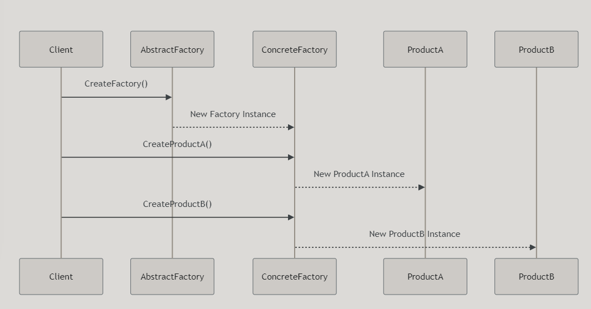

# Abstract Factory Design Pattern

---

# Introduktion

- Vad är Abstract Factory?
- Varför använda Abstract Factory?
- Hur implementerar man Abstract Factory i C#?
- Skillnader mellan Simple Factory, Factory Method och Abstract Factory
- Exempel på användning av Abstract Factory i verkliga situationer

---

# Vad är Abstract Factory?

Abstract Factory är ett designmönster som tillhandahåller ett gränssnitt för att skapa familjer av relaterade eller beroende objekt utan att specificera deras konkreta klasser. 

Det används för att skapa grupper av objekt som hör ihop och behöver användas tillsammans.

---

# Varför använda Abstract Factory?

- **Gruppering av objekt:** Hjälper till att skapa familjer av relaterade objekt som behöver användas tillsammans.
- **Utbytbarhet:** Gör det enkelt att byta ut hela produktfamiljer utan att ändra klientkod.
- **Skalbarhet:** Lätt att lägga till nya produktfamiljer utan att ändra befintlig kod.

---

# Struktur av Abstract Factory

Låt oss titta på den grundläggande strukturen för Abstract Factory-mönstret.

---

# Hur implementerar man Abstract Factory i C#?

Abstract Factory-mönstret involverar följande komponenter:

1. **AbstractFactory**: Ett gränssnitt som deklarerar en mängd skapandemetoder för varje produkt i produktfamiljen.
2. **ConcreteFactory**: Konkret implementation av `AbstractFactory`, som skapar konkreta produkter.
3. **AbstractProduct**: Ett gränssnitt för en typ av produkt.
4. **ConcreteProduct**: Konkret implementation av `AbstractProduct`.

---

# Exempel på användning

Tänk er att vi har en applikation som hanterar olika typer av dokument: text, Markdown och PDF. Vi vill skapa dessa dokument utan att specificera de exakta klasserna.

Vi kan använda Abstract Factory för att skapa familjer av relaterade dokumentobjekt. 

---

# Jämförelse: Simple Factory

**Simple Factory**:
- **Struktur**: En enda fabriksklass med en metod som tar en parameter och returnerar en instans av rätt typ baserat på en switch-sats.
- **Flexibilitet**: Mindre flexibel eftersom varje gång en ny produkt läggs till måste fabriksklassen ändras.
- **Användning**: Enklare scenarier där endast en typ av produkt behövs.

---

# Jämförelse: Factory Method

**Factory Method**:
- **Struktur**: En abstrakt skapandemetod i en bas-klass som implementeras av underklasser för att skapa specifika produkter.
- **Flexibilitet**: Mer flexibel än Simple Factory, tillåter utökning av nya produkter utan att ändra bas-klass.
- **Användning**: När det finns ett behov av att skapa specifika produkter i en hierarki.

---

# Jämförelse: Abstract Factory

**Abstract Factory**:
- **Struktur**: Ett gränssnitt för att skapa en familj av relaterade objekt.
- **Flexibilitet**: Mest flexibel, tillåter byte av hela produktfamiljer utan att ändra klientkod.
- **Användning**: När det finns ett behov av att skapa familjer av relaterade objekt och säkerställa deras kompatibilitet.

---

Med Abstract Factory kan vi skapa olika dokument på ett strukturerat sätt.

---

# Sammanfattning

- **Simple Factory**: Använder en enkel metod med en switch-sats.
- **Factory Method**: Använder en abstrakt metod i en bas-klass och underklasser för specifika produkter.
- **Abstract Factory**: Använder ett gränssnitt för att skapa familjer av relaterade objekt, vilket ger största flexibilitet.

Genom att använda Abstract Factory kan vi skapa flexibla och skalbara lösningar som kan utökas med nya produktfamiljer utan att ändra befintlig kod.

---

# Kod

https://github.com/Campus-Molndal-CLO23/DesignPatterns/blob/main/lecture1/code/04_abstract_factory.cs