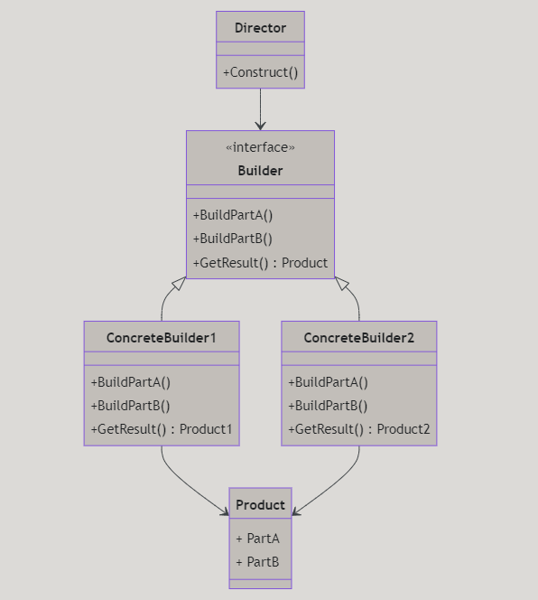
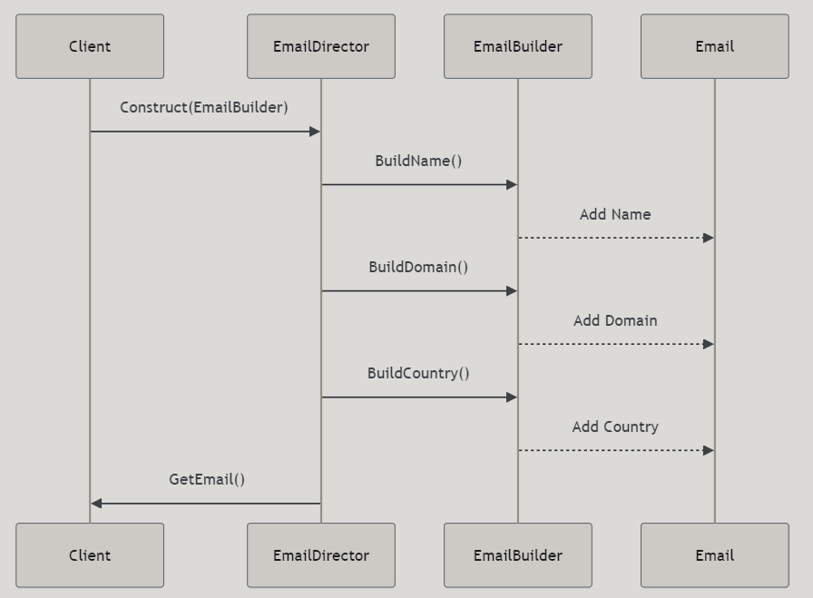

# Builder Design Pattern

---

# Introduktion

- Vad är Builder?
- Varför använda Builder?
- Hur implementerar man Builder i C#?
- Exempel på användning av Builder i verkliga situationer

---

# Vad är Builder?

Builder är ett designmönster som låter dig skapa komplexa objekt genom att specificera deras typ och innehåll steg för steg. Det låter dig skapa olika representationer av ett objekt med samma byggprocess.

---

# Varför använda Builder?

- **Flexibilitet:** Gör det möjligt att skapa olika representationer av ett objekt.
- **Separation:** Separera konstruktionen av ett objekt från dess representation.
- **Läslighet:** Förbättrar kodens läsbarhet och underhållbarhet genom att bryta ned komplexa objekt i mindre delar.

---

# Struktur av Builder

Låt oss titta på den grundläggande strukturen för Builder-mönstret.



---

# Hur implementerar man Builder i C#?

Builder-mönstret involverar följande komponenter:

1. **Director**: Ansvarar för att konstruera objektet med hjälp av Builder.
2. **Builder**: Ett gränssnitt som deklarerar metoder för att skapa delar av objektet.
3. **ConcreteBuilder**: En konkret implementation av Builder som skapar specifika delar av produkten.
4. **Product**: Det komplexa objektet som ska skapas.

---

# Exempel

Tänk dig att vi vill skapa en emailadress.



---

# Användning av Builder

I kod ser det ut så här, utan fluently syntax:

```csharp
var emailBuilder = new EmailDirector();
var email = emailBuilder.BuildEmail("Peter", "Parker", "webcrawler", "us");
Console.WriteLine(email);
```
output:
```
peter.parker@webcrawler.us
```
---

# Användning av Builder

I kod ser det ut så här, med fluently syntax:

```csharp
var emailBuilder = new EmailBuilder();
var email = emailBuilder
    .WithName("Peter")
    .WithLastName("Parker")
    .WithDomain("webcrawler")
    .WithCountry("us")
    .Build();
Console.WriteLine(email);
```
---

# Sammanfattning

- **Builder** är ett designmönster som låter dig skapa komplexa objekt steg för steg.
- Det hjälper till att separera konstruktionen av ett objekt från dess representation.
- Builder-mönstret förbättrar kodens läsbarhet och underhållbarhet genom att bryta ned komplexa objekt i mindre delar.

---

# Kod

https://github.com/Campus-Molndal-CLO23/DesignPatterns/blob/main/lecture1/code/05_builder_01.cs

https://github.com/Campus-Molndal-CLO23/DesignPatterns/blob/main/lecture1/code/05_builder_02.cs