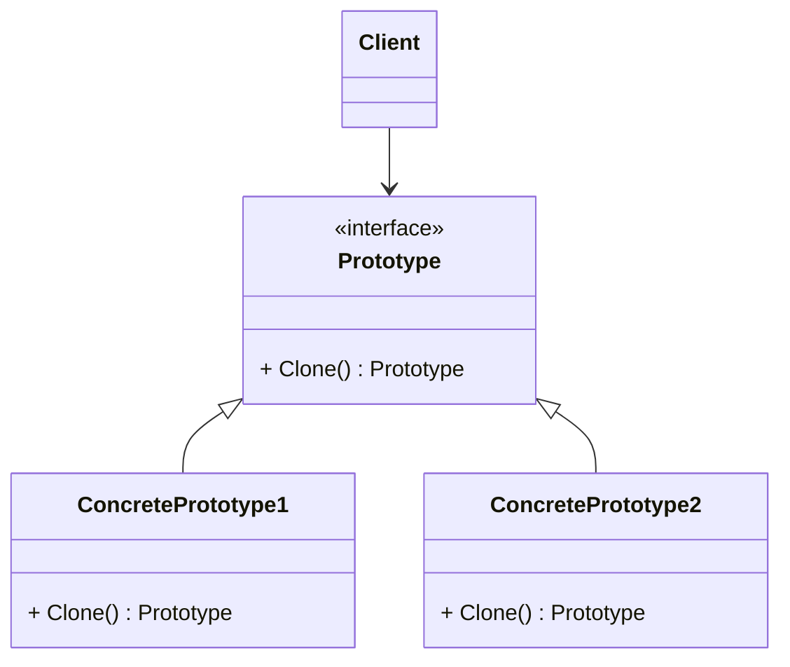
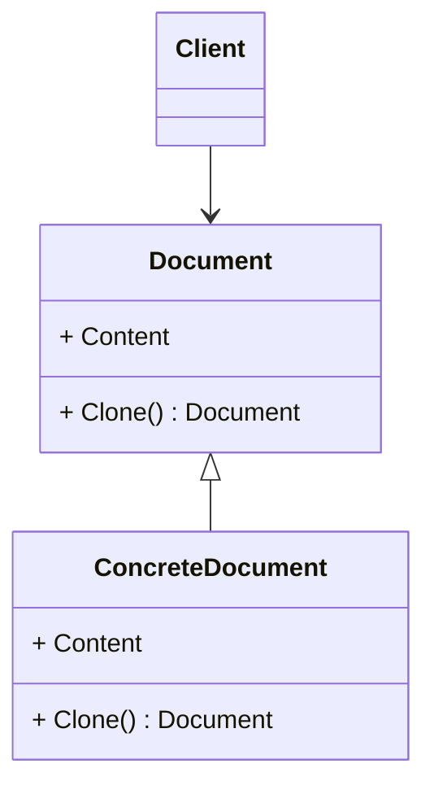
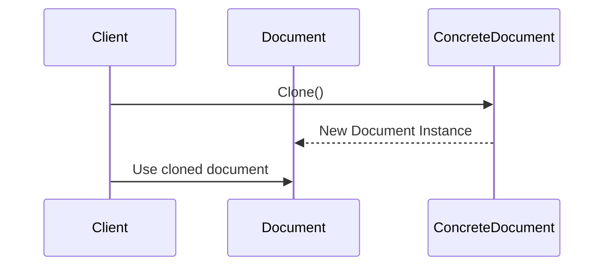

# Prototype Design Pattern

---

# Introduktion

I denna föreläsning ska vi gå igenom Prototype-mönstret, ett designmönster som används för att skapa nya objekt genom att klona existerande objekt. Vi kommer att täcka följande områden:

- Vad är Prototype?
- Varför använda Prototype?
- Hur implementerar man Prototype i C#?
- Exempel på användning av Prototype i verkliga situationer

---

# Vad är Prototype?

Prototype är ett designmönster som låter dig skapa nya objekt genom att klona existerande objekt, istället för att skapa dem från grunden. Det är användbart när kostnaden för att skapa ett nytt objekt är dyr eller komplex.

---

# Varför använda Prototype?

- **Effektivitet:** Kloning av ett existerande objekt kan vara snabbare och kräver färre resurser än att skapa ett nytt objekt från grunden.
- **Enkelhet:** Genom att klona ett objekt kan vi undvika komplexa konstruktionslogiker och istället återanvända redan definierade objekt.
- **Flexibilitet:** Med Prototype kan vi dynamiskt skapa nya objekt utan att behöva känna till deras exakta klasser eller konstruktionsdetaljer.

---

# Struktur av Prototype

Låt oss titta på den grundläggande strukturen för Prototype-mönstret.

---

# Hur implementerar man Prototype i C#?

Prototype-mönstret involverar följande komponenter:

1. **Prototype**: Ett gränssnitt som deklarerar en `Clone`-metod.
2. **ConcretePrototype**: En konkret implementation av `Prototype` som implementerar `Clone`-metoden.
3. **Client**: Använder `Prototype` för att klona objekt.

---

# Fördelar med kloning

- **Prestanda:** I situationer där skapandet av ett objekt är dyrt eller tidskrävande kan kloning vara mycket snabbare.
- **Minskad komplexitet:** När ett objekt har många beroenden eller behöver en komplex initieringsprocess kan kloning förenkla skapandet av nya instanser.
- **Flexibel konfiguration:** Objekt kan konfigureras och anpassas en gång och sedan klonas för att skapa flera liknande instanser med samma konfiguration.

---

# Exempel

Tänk dig att vi vill skapa kopior av ett dokumentobjekt. Vi kan använda Prototype-mönstret för att klona ett existerande dokument istället för att skapa ett nytt från grunden.

---

# Kloningens mekanism

Kloning innebär att skapa en kopia av ett existerande objekt. Här är ett exempel på hur vi kan klona ett dokumentobjekt och varför det är fördelaktigt.

---

# Användning av Prototype

Prototype-mönstret låter oss klona ett objekt istället för att skapa det från grunden. Detta kan vara användbart i flera scenarier:

- När objekt har komplex initieringslogik.
- När objekt måste konfigureras på ett specifikt sätt innan användning.
- När objekt skapas dynamiskt och deras exakta typer inte är kända vid kompileringstid.

---

# Sammanfattning

- **Prototype** är ett designmönster som låter dig skapa nya objekt genom att klona existerande objekt.
- Det hjälper till att skapa objekt effektivt och enkelt genom att undvika komplexa konstruktionslogiker.
- Prototype-mönstret ger flexibilitet genom att låta dig skapa nya objekt dynamiskt utan att behöva känna till deras exakta klasser.

Genom att använda Prototype-mönstret kan vi skapa flexibla och effektiva lösningar som gör det möjligt att skapa nya objekt snabbt och enkelt genom att klona befintliga objekt.

