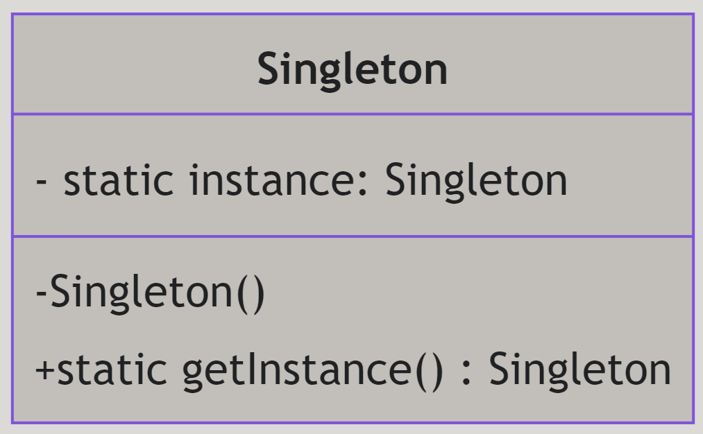

# Singleton Design Pattern

---

# Introduktion


- Vad är Singleton?
- Varför använda Singleton?
- Hur implementerar man Singleton i C#?
- Exempel på användning av Singleton i verkliga situationer

---

# Vad är Singleton?

Singleton är ett designmönster som säkerställer att en klass har endast en instans och ger en global åtkomstpunkt till denna instans. Detta mönster är användbart när exakt en objekt behövs för att koordinera åtgärder i ett system.

---

# Varför använda Singleton?

- **Kontroll av instanser:** Säkerställer att endast en instans av klassen existerar.
- **Global åtkomst:** Ger en global åtkomstpunkt till den enda instansen.
- **Resurshantering:** Används ofta för resurshantering som databasanslutningar eller loggning.

---

# Struktur av Singleton



---

# Hur implementerar man Singleton i C#?

Singleton-mönstret involverar följande komponenter:

1. **Privat konstruktor:** Förhindrar att andra klasser instansierar klassen.
2. **Statisk variabel:** Håller en referens till den enda instansen av klassen.
3. **Statisk metod:** Ger en global åtkomstpunkt till instansen.

---

# Exempel

Tänk dig att vi vill skapa en loggningsklass som endast har en instans under hela applikationens livslängd. 

---

# Kan vi inte bara ha en statisk klass?

Kontroll över livscykeln: En singleton ger möjlighet att kontrollera när instansen skapas och förstörs, vilket är användbart för resurshantering. Statiska klasser initialiseras automatiskt vid första användning och förblir kvar under hela applikationens livstid.

---

# Kan vi inte bara ha en statisk klass?

Arv och polymorfism: Med en singleton kan du använda arv och polymorfism, vilket inte är möjligt med statiska klasser. Detta gör det möjligt att skapa flexibla och återanvändbara kodstrukturer.

---

# Kan vi inte bara ha en statisk klass?

Gränssnittsimplementation: Singletons kan implementera gränssnitt, vilket underlättar beroendeinjektion och enhetstestning med mock-objekt. Detta är inte möjligt med statiska klasser. För att implementera gränssnitt i en statisk klass måste du använda statiska metoder, vilket kan vara begränsande.

---

# Kan vi inte bara ha en statisk klass?

Trådskydd: En singleton kan implementeras med trådskydd för att säkerställa att endast en instans skapas i en flertrådad miljö, vilket kan vara viktigt i vissa scenarier.

---

# Kan vi inte bara ha en statisk klass?

Dessa aspekter gör singletons mer flexibla och anpassningsbara jämfört med statiska klasser.

---

# Implementering av Singleton

För att implementera Singleton-mönstret i C# följer vi dessa steg:

1. Deklarera en privat statisk variabel för att hålla den enda instansen.
2. Definiera en privat konstruktor för att förhindra att klassen instansieras utanför.
3. Skapa en statisk metod för att returnera den enda instansen.

---

# Implementering av Singleton

```csharp
public class Logger {
    private static Logger instance;
    private Logger() { }

    public static Logger getInstance() {
        if (instance == null) {
            instance = new Logger();
        }
        return instance;
    }

    public void Log(string message) {
        Console.WriteLine("Log: " + message);
    }
}
```

---

# Användning av Singleton

För att använda Singleton-klassen kan vi anropa `getInstance`-metoden och sedan använda dess metoder.

```csharp
Logger logger = Logger.getInstance();
logger.Log("Detta är en loggmeddelande.");
```

---

# Varning!

Singleton-mönstret kan vara känsligt för flertrådade program. Om flera trådar försöker skapa instansen samtidigt kan det leda till flera instanser av klassen.

För att undvika detta problem kan vi använda låsning eller andra tekniker för att säkerställa att endast en instans skapas.

---

# Trådsäker

```csharp
public class Logger {
    private static Logger instance;
    private static readonly object lockObject = new object();
    private Logger() { }

    public static Logger getInstance() {
        lock (lockObject) {
            if (instance == null) { instance = new Logger(); }
        }
        return instance;
    }

    public void Log(string message) {Console.WriteLine("Log: " + message);}
}
```

---

# Fördelar och Nackdelar

### Fördelar:
- **Enkel instansiering:** Säkerställer en enda instans av en klass.
- **Global åtkomst:** Enkel åtkomst till instansen globalt.

--- 

### Nackdelar:
- **Global tillstånd:** Kan leda till problem med globalt tillstånd i programmet.
- **Svår att testa:** Kan vara svår att enhetstesta på grund av sin globala åtkomstpunkt.

---

# Sammanfattning

- **Singleton** är ett designmönster som säkerställer att en klass har endast en instans.
- Det hjälper till att kontrollera instanser och ger en global åtkomstpunkt.
- Singleton-mönstret används ofta för resurshantering som databasanslutningar eller loggning.

Genom att använda Singleton-mönstret kan vi säkerställa att endast en instans av en klass existerar och att denna instans är tillgänglig globalt.

