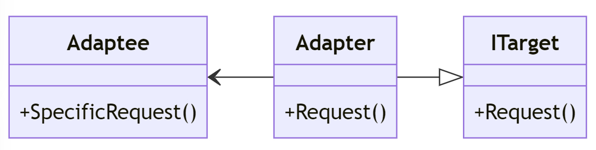
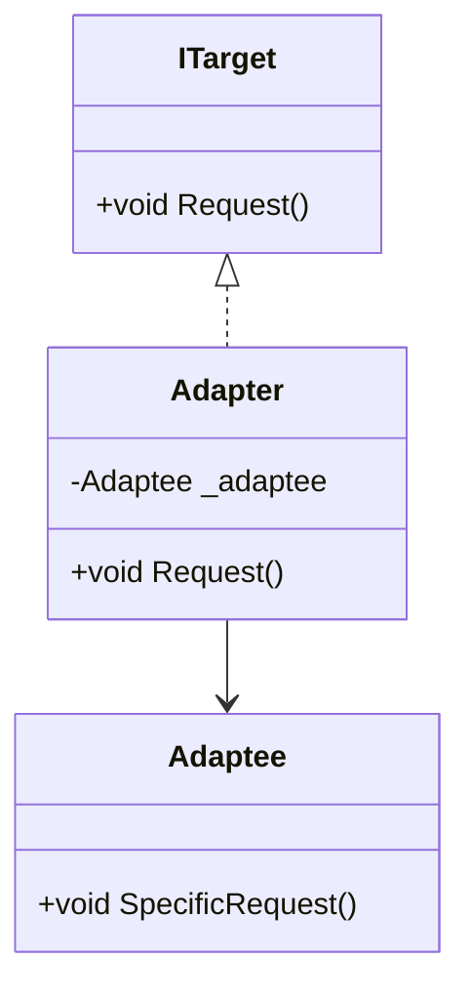

# Adapter Pattern i C#

## Introduktion

Adapter-mönstret används för att "adapta" en befintlig klass så att den kan användas som en annan typ. Det är användbart när vi vill använda en klass som inte har det gränssnitt som vi behöver.

---

## Problem

Vi har två inkompatibla gränssnitt:
- `ITarget`
- `Adaptee`

Vi behöver en adapter för att göra dessa kompatibla.

---

## UML-diagram



---

## Lösning

Med Adapter-mönstret kan vi skapa en `Adapter`-klass som implementerar `ITarget` och använder en instans av `Adaptee`.

```csharp
// ITarget interface
public interface ITarget
{
    void Request();
}

```

---

```csharp
// Adaptee class
public class Adaptee
{
    public void SpecificRequest()
    {
        Console.WriteLine("Called SpecificRequest()");
    }
}

```

---

```csharp
// Adapter class
public class Adapter : ITarget
{
    private readonly Adaptee _adaptee;

    public Adapter(Adaptee adaptee)
    {
        _adaptee = adaptee;
    }

    public void Request()
    {
        _adaptee.SpecificRequest();
    }
}
```

---

## Klassdiagram



---

## Exempel

Låt oss se hur vi kan använda Adapter-mönstret i praktiken:

```csharp
public class Client
{
    private readonly ITarget _target;

    public Client(ITarget target)
    {
        _target = target;
    }

    public void MakeRequest()
    {
        _target.Request();
    }
}
```

---

```csharp
class Program
{
    static void Main(string[] args)
    {
        Adaptee adaptee = new Adaptee();
        ITarget target = new Adapter(adaptee);
        Client client = new Client(target);

        client.MakeRequest();
    }
}
```

Output:
```
Called SpecificRequest()
```

---

## Fördelar och Nackdelar

### Fördelar
- Gör klasser med inkompatibla gränssnitt kompatibla.
- Följer Single Responsibility Principle genom att separera gränssnitt och implementering.

### Nackdelar
- Kan öka systemets komplexitet med fler klasser.

---

# Andra exempel

- En adapter för olika typer av skrivare.
- En adapter för att anpassa en tredjepartsbibliotek till vårt eget gränssnitt.
- En adapter för att anpassa en databasdrivrutin till vårt eget gränssnitt.

---

## Vad skiljer en Adapter från en Fasad?

- En Adapter används för att **anpassa** en klass till en annan klass.
- En Fasad används för att **förenkla** ett gränssnitt för att göra det enklare att använda.

Koden är liknande men syftet är olika, därav namnet. Precis som vi kallar en POCO-klass för Modell när vi använder den i en MVC-applikation.

---

## Sammanfattning

En Adapter är en bro mellan två inkompatibla gränssnitt. Den konverterar en eller flera metoder från en klass till en annan klass. Den används när vi vill använda en klass som inte har det gränssnitt som vi behöver.

Adapter-mönstret möjligör för oss att hantera inkompatibla gränssnitt och ger oss också återanvändning av befintlig kod. Det är viktigt att förstå när och hur man ska använda det för att undvika onödig komplexitet i systemet.
