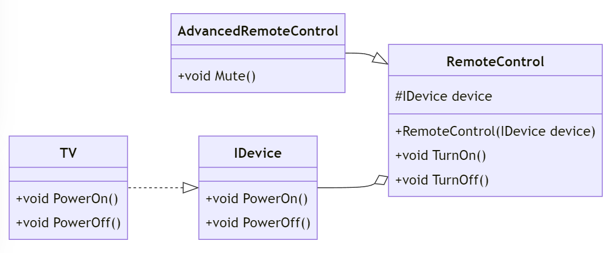

# Bridge Pattern i C#

## Introduktion

_...och då menar jag inte kortspelet :P_

---

## Introduktion

Bridge-mönstret används för att separera abstraktionen från implementeringen så att de båda kan förändras oberoende av varandra. Detta mönster är användbart när man vill undvika en explosion av klasser genom att dela upp dem i två hierarkier.

---

## Problem

Vi har två hierarkier:

- Abstraktion
- Implementering

Den ena är beroende av den andra, vilket leder till en ömsesidig koppling.

Vi behöver en lösning för att minska beroendet mellan dessa hierarkier.

---
## Lösning

Med Bridge-mönstret kan vi skapa en brygga mellan abstraktionen och implementeringen.

Detta gör det möjligt att förändra abstraktion och implementering oberoende av varandra.

I detta exempel kommer vi att använda en fjärrkontroll som abstraktion och en TV som implementering.

---

```csharp
// Abstraction
public abstract class RemoteControl
{
    protected IDevice device;

    protected RemoteControl(IDevice device)
    {
        this.device = device;
    }

    public abstract void TurnOn();
    public abstract void TurnOff();
}
```

---

```csharp
// Implementor
public interface IDevice
{
    void PowerOn();
    void PowerOff();
}
```

---

```csharp
// Concrete Implementor
public class TV : IDevice
{
    public void PowerOn()
    {
        Console.WriteLine("TV is ON");
    }

    public void PowerOff()
    {
        Console.WriteLine("TV is OFF");
    }
}
```

---

```csharp
// Refined Abstraction
public class AdvancedRemoteControl : RemoteControl
{
    public AdvancedRemoteControl(IDevice device) : base(device)
    {
    }

    public override void TurnOn()
    {
        device.PowerOn();
    }
```

---

```csharp
    public override void TurnOff()
    {
        device.PowerOff();
    }

    public void Mute()
    {
        Console.WriteLine("TV is Muted");
    }
}
```

---

## Exempel

Låt oss se hur vi kan använda Bridge-mönstret i praktiken:

```csharp
class Program
{
    static void Main(string[] args)
    {
        IDevice tv = new TV();
        RemoteControl remote = new AdvancedRemoteControl(tv);

        remote.TurnOn();
        remote.TurnOff();
        ((AdvancedRemoteControl)remote).Mute();
    }
}
```

---

Output:

```
TV is ON
TV is OFF
TV is Muted
```

---

## Klassdiagram



---

## Fördelar och Nackdelar

### Fördelar

- Gör det möjligt att förändra abstraktion och implementering oberoende av varandra.
- Förbättrar kodens skalbarhet och flexibilitet.

### Nackdelar

- Kan öka systemets komplexitet med fler klasser och gränssnitt.

---

## Andra exempel

- Grafikbibliotek - Abstraktionen kan vara en form och implementeringen kan vara en färg.
- Bankapplikation - Abstraktionen kan vara en konto och implementeringen kan vara en bank.
- Operativsystem - Abstraktionen kan vara en fil och implementeringen kan vara en lagringsenhet.

---

## Slutsats

Bridge-mönstret är användbart för att separera abstraktionen från implementeringen och undvika en ömsesidig koppling mellan dem. Det gör det möjligt att förändra abstraktion och implementering oberoende av varandra, vilket förbättrar kodens skalbarhet och flexibilitet.

Vi kan ta två helt oberorende hierarkier och koppla ihop dem med hjälp av en brygga.

---

## Hur skiljer sig Bridge från Adapter eller Fasad?

- Adapter-mönstret används för att göra två inkompatibla gränssnitt kompatibla.
- Bridge-mönstret används för att separera abstraktionen från implementeringen så att de båda kan förändras oberoende av varandra.
- Fasad-mönstret används för att skapa en enkel gränssnitt för att interagera med ett komplext system.

---

## Sammanfattning

Bridge-mönstret låter oss hantera komplexa system med flera hierarkier. Det separerar abstraktionen från implementeringen, vilket möjliggör större flexibilitet och underlättar underhållet av koden.
