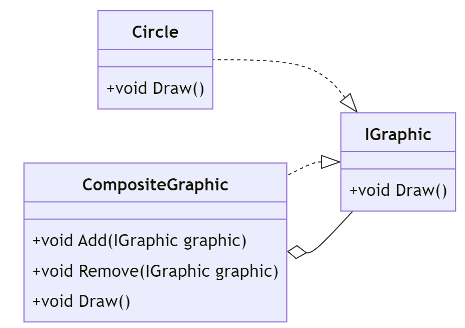

# Composite Pattern i C#

## Introduktion

Composite-mönstret används för att behandla enskilda objekt och sammansatta objekt på ett enhetligt sätt. Det är användbart när vi vill representera hierarkiska trädstrukturer.

---

## Förenklat

Composite-mönstret används för att skapa en trädstruktur av objekt där enskilda objekt och sammansatta objekt implementerar samma gränssnitt. Precis som en filsystemstruktur där en mapp kan innehålla filer och andra mappar.

---

## Problem

Vi har en hierarki av objekt där enskilda objekt och sammansatta objekt ska behandlas på samma sätt.

I detta exempel kommer vi att skapa en grafisk struktur där vi har enskilda grafiska objekt som cirklar och sammansatta grafiska objekt som innehåller flera grafiska objekt.

---

## Lösning

Med Composite-mönstret kan vi skapa en trädstruktur där enskilda objekt och sammansatta objekt implementerar samma gränssnitt.

```csharp
// Component
public interface IGraphic
{
    void Draw();
}

// Leaf
public class Circle : IGraphic
{
    public void Draw()
    {
        Console.WriteLine("Drawing Circle");
    }
}
```

---

```csharp
// Composite
public class CompositeGraphic : IGraphic
{
    private List<IGraphic> _graphics = new List<IGraphic>();

    public void Add(IGraphic graphic)
    {
        _graphics.Add(graphic);
    }

    public void Remove(IGraphic graphic)
    {
        _graphics.Remove(graphic);
    }
```

---

```csharp
    public void Draw()
    {
        foreach (var graphic in _graphics)
        {
            graphic.Draw();
        }
    }
}
```

---

## Klassdiagram



---

## Exempel

Låt oss se hur vi kan använda Composite-mönstret i praktiken:

```csharp
class Program
{
    static void Main(string[] args)
    {
        // Skapa enskilda grafiska objekt
        IGraphic circle1 = new Circle();
        IGraphic circle2 = new Circle();
```

---

```csharp
        // Skapa en sammansatt grafisk objekt
        CompositeGraphic graphic = new CompositeGraphic();
        graphic.Add(circle1);
        graphic.Add(circle2);
```

---

```csharp
        // Rita den sammansatta grafiken
        graphic.Draw();
    }
}
```

---

## Output:

```
Drawing Circle
Drawing Circle
```

---

## Fördelar och Nackdelar

### Fördelar

- Enhetlig hantering av enskilda och sammansatta objekt.
- Förenklar klientkoden genom att behandla alla objekt på samma sätt.

### Nackdelar

- Kan göra systemet mer komplext med fler klasser och gränssnitt.

---

## Andra exempel

- Filsystemstruktur
- Menyer i en restaurangapplikation
- Grafiska användargränssnitt
- Vapen i ett spel

---

## Hur skiljer sig Composite från andra mönster?

Composite-mönstret skiljer sig från andra mönster genom att det fokuserar på att skapa hierarkiska trädstrukturer av objekt. Det låter oss behandla enskilda objekt och sammansatta objekt på samma sätt.

Andra mönster som Adapter, Decorator och Proxy fokuserar på att lägga till funktionalitet till ett objekt utan att ändra dess gränssnitt.

---

## Varför heter den Composite?

Composite-mönstret kallas så eftersom det låter oss skapa en sammansatt struktur av objekt där enskilda objekt och sammansatta objekt implementerar samma gränssnitt. Det är som att komponera flera objekt till ett enda objekt.

---

## Varför ska jag använda Composite?

Composite-mönstret är användbart när vi vill skapa hierarkiska trädstrukturer av objekt där enskilda objekt och sammansatta objekt ska behandlas på samma sätt. Det låter oss skapa en enhetlig struktur av objekt och förenklar klientkoden.

---

## Sammanfattning

Composite-mönstret låter oss hantera hierarkiska strukturer av objekt. Det möjliggör enhetlig behandling av enskilda och sammansatta objekt och förenklar klientkoden.

Den ger oss möjlighet att skapa trädstrukturer av objekt där enskilda objekt och sammansatta objekt implementerar samma gränssnitt. 

---

Om vår Circle hade fått innehålla IGraphic så hade vi kunnat skapa en oändlig mängd av cirklar.

Eller så hade vi kunnat ge Circle en lista av IGraphic och låta den vara en CompositeGraphic. Då hade vi kunnat skapa en oändlig mängd av cirklar och andra objekt. Och ändå rita ut alla samtidigt.

Spännande! Eller hur?

