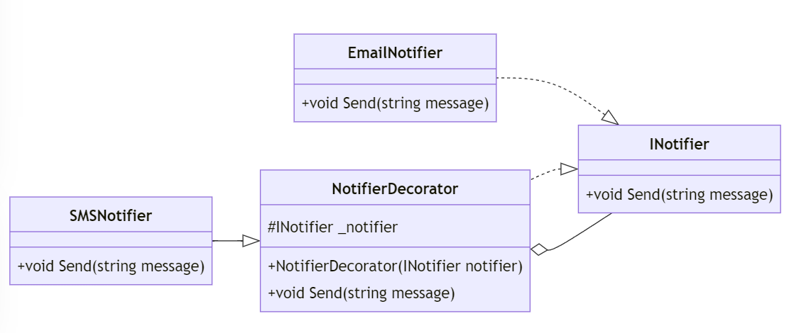

# Decorator Pattern i C#

## Introduktion

Decorator-mönstret används för att lägga till ansvar till objekt dynamiskt. Det är användbart när vi vill utöka funktionaliteten av en klass på ett flexibelt sätt utan att ändra dess kod.

---

## Problem

Vi har en klass där vi vill lägga till ny funktionalitet utan att ändra dess befintliga kod.

---

## Lösning

Med Decorator-mönstret kan vi "dekorera" en klass med ny funktionalitet genom att använda en wrapper-klass.

```csharp
// Component
public interface INotifier
{
    void Send(string message);
}
```

---

```csharp
// Concrete Component
public class EmailNotifier : INotifier
{
    public void Send(string message)
    {
        Console.WriteLine($"Sending Email: {message}");
    }
}

// Decorator
public abstract class NotifierDecorator : INotifier
{
    protected INotifier _notifier;

    protected NotifierDecorator(INotifier notifier)
    {
        _notifier = notifier;
    }

    public virtual void Send(string message)
    {
        _notifier.Send(message);
    }
}
```

---

```csharp
// Concrete Decorator
public class SMSNotifier : NotifierDecorator
{
    public SMSNotifier(INotifier notifier) : base(notifier)
    {
    }

    public override void Send(string message)
    {
        base.Send(message);
        Console.WriteLine($"Sending SMS: {message}");
    }
}
```

---

## Klassdiagram




---

## Exempel

Låt oss se hur vi kan använda Decorator-mönstret i praktiken:

```csharp
class Program
{
    static void Main(string[] args)
    {
        INotifier emailNotifier = new EmailNotifier();
        INotifier smsNotifier = new SMSNotifier(emailNotifier);

        // Skicka meddelande med både email och SMS
        smsNotifier.Send("Hello World!");
    }
}
```

---

## Output:

```
Sending Email: Hello World!
Sending SMS: Hello World!
```

---

## Kodförklaring

1. Vi skapar en `EmailNotifier`-klass som implementerar `INotifier`-gränssnittet.
2. Vi skapar en `NotifierDecorator`-abstrakt klass som implementerar `INotifier`-gränssnittet och innehåller en referens till en `INotifier`-instans.
3. Vi skapar en `SMSNotifier`-klass som ärver från `NotifierDecorator` och lägger till SMS-funktionalitet.
4. Vi skapar en instans av `EmailNotifier` och dekorerar den med `SMSNotifier` för att skicka meddelanden via både email och SMS.
5. Vi skickar ett meddelande med både email och SMS.

---

## Fördelar och Nackdelar

### Fördelar
- Ger större flexibilitet än arv för att utöka funktionalitet.
- Följer Open/Closed Principle genom att lägga till ny funktionalitet utan att ändra befintlig kod.

### Nackdelar
- Kan leda till många små klasser som kan vara svåra att förstå och underhålla.

---

## Hur skiljer sig Decorator från Adapter, Bridge, Composite och Fasad?

- Decorator lägger till ansvar dynamiskt
- Bridge separerar abstraktion från implementering.
- Composite sammansätter objekt till trädstrukturer ansvar.
- Fasad ger ett enkelt gränssnitt till ett komplext system.

---

## Andra exempel

- Grafiska användargränssnitt (GUI) där vi kan dekorera en enkel knapp med olika färger, text, bilder etc.
- Kryptering där vi kan dekorera en fil med olika krypteringsalgoritmer.
- Cache där vi kan dekorera en databasfråga med cache-funktionalitet.

---

## Sammanfattning

Decorator-mönstret ger oss möjligheten att lägga till ansvar till objekt. Det ger en flexibel lösning för att utöka funktionaliteten utan att ändra den befintliga koden.

