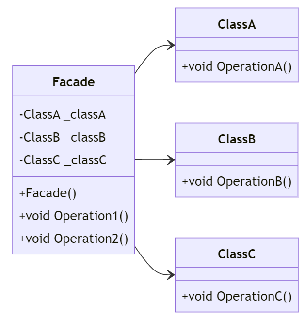

# Facade Pattern i C#

## Introduktion

Facade-mönstret används för att tillhandahålla ett förenklat gränssnitt till ett komplext subsystem. Det är användbart när vi vill dölja komplexiteten hos ett system och göra det enklare att använda. Vi har tidigare använt detta mönster för att förenkla kommunikationen med databaser.

---

## Problem

Vi har ett komplext subsystem med många interaktioner som är svårt att använda direkt. Till exempel, interaktion med en databas som kräver flera steg och detaljer.

---

## Lösning

Med Facade-mönstret kan vi skapa en enkel gränssnittsklass som kapslar in det komplexa systemet.

```csharp
// Subsystem ClassA
public class ClassA
{
    public void OperationA()
    {
        Console.WriteLine("Operation A");
    }
}
```

---

```csharp
// Subsystem ClassB
public class ClassB
{
    public void OperationB()
    {
        Console.WriteLine("Operation B");
    }
}
```

---

```csharp
// Subsystem ClassC
public class ClassC
{
    public void OperationC()
    {
        Console.WriteLine("Operation C");
    }
}
```

---

```csharp
// Facade
public class Facade
{
    private ClassA _classA;
    private ClassB _classB;
    private ClassC _classC;

    public Facade()
    {
        _classA = new ClassA();
        _classB = new ClassB();
        _classC = new ClassC();
    }
```

---

```csharp
    public void Operation1()
    {
        _classA.OperationA();
        _classB.OperationB();
    }

    public void Operation2()
    {
        _classB.OperationB();
        _classC.OperationC();
    }
}
```

---

## Klassdiagram



---

## Exempel

Låt oss se hur vi kan använda Facade-mönstret i praktiken:

```csharp
class Program
{
    static void Main(string[] args)
    {
        Facade facade = new Facade();

        // Använda Facade för att utföra operationer
        facade.Operation1();
        facade.Operation2();
    }
}
```

Output:

```
Operation A
Operation B
Operation B
Operation C
```

---

## Om exemplet

Detta exempel skiljer sig från tidigare exempel genom att vi har tre olika klasser som representerar ett komplext subsystem. Facade-klassen innehåller instanser av dessa klasser och tillhandahåller enkla metoder för att utföra operationer på dem.

Det visar att det inte finns enbart ett sätt att använda designmönster, utan att de kan anpassas efter behov och situationer.

---

## Användning av Facade för Databasinteraktion

Vi har tidigare använt Facade-mönstret för att förenkla kommunikationen med databaser. Istället för att hantera alla steg för databasanslutning, kommandon och transaktioner, kan en Facade tillhandahålla ett förenklat gränssnitt:

---

```csharp
// Facade for Database Operations
public class DatabaseFacade
{
    private string _connectionString;

    public DatabaseFacade(string connectionString)
    {
        _connectionString = connectionString;
    }
```

---

```csharp
    public void ExecuteQuery(string query)
    {
        using (SqlConnection connection = new SqlConnection(_connectionString))
        {
            connection.Open();
            using (SqlCommand command = new SqlCommand(query, connection))
            {
                command.ExecuteNonQuery();
            }
        }
    }
```

---

```csharp
    public DataTable FetchData(string query)
    {
        DataTable dataTable = new DataTable();
        using (SqlConnection connection = new SqlConnection(_connectionString))
        {
            connection.Open();
            using (SqlCommand command = new SqlCommand(query, connection))
            {
                using (SqlDataAdapter adapter = new SqlDataAdapter(command))
                {
                    adapter.Fill(dataTable);
                }
            }
        }
        return dataTable;
    }
}
```

---

## Användning av Facade för Databasinteraktion

```csharp
class Program
{
    static void Main(string[] args)
    {
        string connectionString = "Data Source=.;Initial Catalog=master;Integrated Security=True";
        DatabaseFacade database = new DatabaseFacade(connectionString);

        // Använda Facade för att utföra databasoperationer
        database.ExecuteQuery("CREATE DATABASE TestDB");
        DataTable dataTable = database.FetchData("SELECT * FROM sys.databases");
    }
}
```
---

## Fördelar och Nackdelar

### Fördelar

- Förenklar användningen av ett komplext subsystem.
- Minskar beroenden mellan klientkod och subsystemet.
- Gör det lätt att byta ut eller uppgradera subsystemet utan att påverka klientkoden.

---

### Nackdelar

- Facade kan bli ett problem om det blir för stort och börjar innehålla för mycket logik. I så fall kan det vara bättre att dela upp det i mindre delar.
- Det kan vara svårt att underhålla om subsystemet ändras och Facade inte längre är korrekt.
- Det kan vara svårt att testa om Facade innehåller mycket logik.

---

### Tips

- Använd Facade för att förenkla komplexa system och göra dem lättare att använda.
- Använd Facade för att isolera klientkod från subsystemet och minska beroenden.
- Se till att Facade inte blir för stor och innehåller för mycket logik.
- Unvik Gud-objektet genom att dela upp Facade i mindre delar om det blir för stort.
- Testa Facade för att säkerställa att den fungerar korrekt.
- Mocka det fasaden använder för att testa fasaden.

---

## Sammanfattning

Facade-mönstret bra för att hantera komplexa system. Det tillhandahåller ett förenklat gränssnitt och minskar beroenden mellan klientkod och subsystemet. Vi har sett hur det kan användas för att förenkla databasinteraktioner och andra komplexa system.
