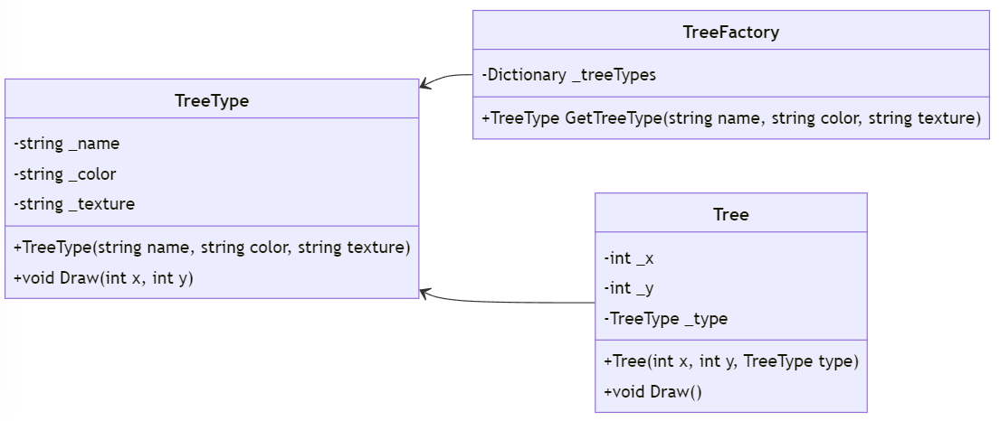

# Flyweight Pattern i C#

## Introduktion

Flyweight-mönstret används för att minska minnesanvändningen genom att dela så mycket data som möjligt med liknande objekt. Det är användbart när ett stort antal objekt med liknande egenskaper skapas.

---

## Problem

Vi har ett stort antal objekt med liknande egenskaper som leder till hög minnesanvändning. Till exempel, ett grafiskt program som hanterar många träd.

---

## Lösning

Med Flyweight-mönstret kan vi dela gemensamma delar av objekt för att minska minnesanvändningen.

```csharp
// Flyweight
public class TreeType
{
    private string _name;
    private string _color;
    private string _texture;

    public TreeType(string name, string color, string texture)
    {
        _name = name;
        _color = color;
        _texture = texture;
    }
```

----

```csharp

    public void Draw(int x, int y)
    {
        Console.WriteLine($"Drawing tree of type {_name} at ({x}, {y})");
    }
}
```

---

```csharp
// Flyweight Factory
public class TreeFactory
{
    private Dictionary<string, TreeType> _treeTypes = new Dictionary<string, TreeType>();

    public TreeType GetTreeType(string name, string color, string texture)
    {
        string key = $"{name}_{color}_{texture}";

        if (!_treeTypes.ContainsKey(key))
        {
            _treeTypes[key] = new TreeType(name, color, texture);
        }
        return _treeTypes[key];
    }
}
```

---

```csharp
// Context
public class Tree
{
    private int _x;
    private int _y;
    private TreeType _type;

    public Tree(int x, int y, TreeType type)
    {
        _x = x;
        _y = y;
        _type = type;
    }

    public void Draw()
    {
        _type.Draw(_x, _y);
    }
}
```

---

## Klassdiagram



---

## Exempel

Låt oss se hur vi kan använda Flyweight-mönstret i praktiken:

```csharp
class Program
{
    static void Main(string[] args)
    {
        TreeFactory factory = new TreeFactory();

        TreeType oakType = factory.GetTreeType("Oak", "Green", "Rough");
        TreeType pineType = factory.GetTreeType("Pine", "Green", "Smooth");

```

---

```csharp
        List<Tree> trees = new List<Tree>
        {
            new Tree(1, 1, oakType),
            new Tree(2, 2, oakType),
            new Tree(3, 3, pineType),
            new Tree(4, 4, pineType)
        };
        foreach (var tree in trees)
        {
            tree.Draw();
        }
    }
}
```

---

# Output:

```
Drawing tree of type Oak at (1, 1)
Drawing tree of type Oak at (2, 2)
Drawing tree of type Pine at (3, 3)
Drawing tree of type Pine at (4, 4)
```

---

## Fördelar och Nackdelar

### Fördelar

- Minskar minnesanvändningen genom att dela gemensamma data.
- Förbättrar prestanda när ett stort antal liknande objekt skapas.

### Nackdelar

- Kan öka komplexiteten i koden genom att införa ett extra lager av abstraktion.
- Kräver att objekt är oföränderliga (immutable) för att kunna dela data säkert.

---

## Hur skiljer sig Flyweight från Adapter, Brigde, Composite, Decorator och Fasad?

- Flyweight fokuserar på att dela gemensam data mellan objekt.
- Adapter anpassar gränssnitt mellan olika klasser.
- Bridge separerar abstraktion från implementering.
- Composite sammansätter objekt till trädstrukturer.
- Decorator lägger till ansvar dynamiskt.
- Fasad ger ett enkelt gränssnitt till ett komplext system.

---

## Sammanfattning

Flyweight-mönstret hjälper oss att hantera minnesanvändning i system med ett stort antal liknande objekt. Det möjliggör delning av gemensamma data och förbättrar prestanda.

Vi delar upp koden i legobitar helt enkelt, och återanvänder dem när vi skapar nya objekt, på så sätt delar alla sammanhängande objekt samma data.

Smart va! 😎
