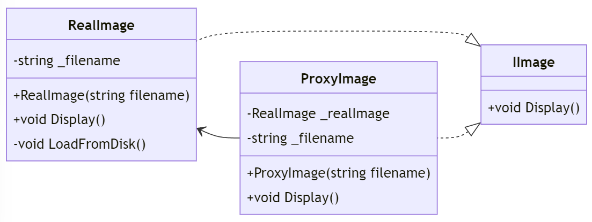

# Proxy Pattern i C#

## Introduktion

Proxy-mönstret används för att tillhandahålla en surrogat eller platsförhållande för ett annat objekt för att kontrollera åtkomst till det. Det är användbart när vi vill lägga till en extra nivå av kontroll innan vi får tillgång till objektet.

---

## Likt en webbproxy

Proxy-mönstret kan liknas vid en webbproxy som agerar som en mellanhand mellan användaren och webbservern. Den kontrollerar åtkomst till webbresurser och kan tillföra extra funktionalitet som cache, loggning, eller säkerhet.

På samma sätt kan vi använda Proxy-mönstret för att kontrollera åtkomst till objekt och tillföra extra funktionalitet.

---

## Problem

Vi vill kontrollera åtkomst till ett objekt eller lägga till funktionalitet innan vi får tillgång till det.

---

## Lösning

Med Proxy-mönstret kan vi skapa en proxy-klass som kontrollerar åtkomst till ett objekt eller tillför ytterligare funktionalitet.

```csharp
// Subject
public interface IImage
{
    void Display();
}
```

---

```csharp
// RealSubject
public class RealImage : IImage
{
    private string _filename;

    public RealImage(string filename)
    {
        _filename = filename;
        LoadFromDisk();
    }

    private void LoadFromDisk()
    {
        Console.WriteLine($"Loading {_filename}");
    }

    public void Display()
    {
        Console.WriteLine($"Displaying {_filename}");
    }
}
```

---

```csharp
// Proxy
public class ProxyImage : IImage
{
    private RealImage _realImage;
    private string _filename;

    public ProxyImage(string filename)
    {
        _filename = filename;
    }

    public void Display()
    {
        if (_realImage == null)
        {
            _realImage = new RealImage(_filename);
        }
        _realImage.Display();
    }
}
```

---

## Klassdiagram



---

## Exempel

Låt oss se hur vi kan använda Proxy-mönstret i praktiken:

```csharp
class Program
{
    static void Main(string[] args)
    {
        IImage image1 = new ProxyImage("image1.jpg");
        IImage image2 = new ProxyImage("image2.jpg");
```

---

```csharp
        // Bilden laddas från disken och visas
        image1.Display();

        // Bilden visas direkt utan att laddas från disken
        image1.Display();

        // Bilden laddas från disken och visas
        image2.Display();
    }
}
```

---

## Output:

```
Loading image1.jpg
Displaying image1.jpg
Loading image2.jpg
Displaying image2.jpg
```

---

## Fördelar och Nackdelar

### Fördelar

- Kontrollerar åtkomst till ett objekt och kan tillföra extra funktionalitet.
- Kan spara resurser genom att initiera objekt på begäran (lazy initialization).

---

### Nackdelar

- Kan öka komplexiteten i koden med fler klasser och gränssnitt.
- Proxy måste spegla RealSubject:s gränssnitt, vilket kan leda till kodduplication.

---

## Vad skiljer Proxy från Adapter, Brigde, Composite, Decorator, Facade och Flyweight?

- Proxy kontrollerar åtkomst till objekt och tillför extra funktionalitet.
- Adapter anpassar gränssnitt mellan olika klasser.
- Bridge separerar abstraktion från implementering.
- Composite sammansätter objekt till trädstrukturer.
- Decorator lägger till ansvar dynamiskt.
- Facade ger ett enkelt gränssnitt till ett komplext system.
- Flyweight delar gemensam data mellan objekt.

---

## Sammanfattning

Proxy-mönstret är ett kraftfullt verktyg för att hantera åtkomstkontroll och tillföra ytterligare funktionalitet till objekt. Det möjliggör lazy initialization och kan spara resurser genom att fördröja objektinitialisering.
