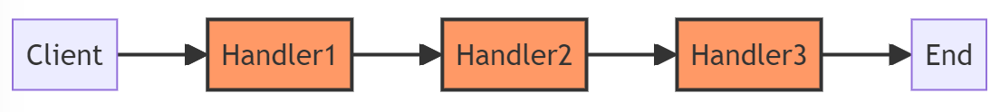

# Chain of Responsibility

---

## Introduktion

Chain of Responsibility är ett designmönster som används för att undvika att koppla avsändaren av en begäran till mottagaren genom att ge mer än ett objekt chansen att hantera begäran. Det skapar en kedja av objekt.

Det fungerar som en Switch men med flera nivåer av hantering. Om en handler inte kan hantera begäran, skickar den vidare till nästa handler i kedjan.

---

## Användningsområden

- När fler än ett objekt kan hantera en begäran och avsändaren inte vet vilket objekt som kommer att hantera det.
- När villkoren för hantering av en begäran ändras dynamiskt.

---

## Struktur



---

## Steg 1: Definiera ett Handler Interface

För att implementera Chain of Responsibility, börja med att definiera ett interface som alla handlers ska implementera. Detta interface innehåller metoder för att sätta nästa handler i kedjan och för att hantera en begäran.

```csharp
public interface IHandler
{
    IHandler SetNext(IHandler handler);
    void Handle(string request);
}
```

_Detta påminner mycket om en länkad lista_ ;)
(OBS! .net har redan en sådan i `LinkedList<T>`)

---

## Vad gör interfacet?

Interfacet `IHandler` definierar två metoder:

- `SetNext(IHandler handler)`: Används för att länka ihop handlers i kedjan.
- `Handle(string request)`: Används för att hantera en begäran. Om en handler inte kan hantera begäran, skickar den vidare till nästa handler i kedjan.

---

## Steg 2: Skapa en Abstrakt Handler

En abstrakt handler implementerar grundläggande funktionalitet för att sätta nästa handler i kedjan. Den innehåller också en virtuell metod för att hantera begäran, som kan överridas av konkreta handlers.

```csharp
public abstract class AbstractHandler : IHandler
{
    private IHandler _nextHandler;

    public IHandler SetNext(IHandler handler)
    {
        _nextHandler = handler;
        return handler;
    }
```

---

```csharp
    public virtual void Handle(string request)
    {
        // Kod som hanterar begäran
        // Om handler inte kan hantera begäran, skicka vidare till nästa handler
        if (_nextHandler != null)
        {
            _nextHandler.Handle(request);
        }
    }
}
```

---

## Vad gör den abstrakta handlern?

- `SetNext(IHandler handler)`: Sätter nästa handler i kedjan.
- `Handle(string request)`: Försöker hantera begäran. Om den inte kan, skickar den vidare till nästa handler.

Den abstrakta handlern innehåller den grundläggande logiken för kedjan. Konkreta handlers kommer att överrida `Handle`-metoden för att lägga till specifik hanteringslogik.

---

## Steg 3: Skapa Konkreta Handlers

Konkreta handlers är de klasser som faktiskt kommer att hantera olika typer av begäranden. Låt oss skapa tre konkreta handlers: LowLevelHandler, MidLevelHandler och HighLevelHandler.

### LowLevelHandler

```csharp
public class LowLevelHandler : AbstractHandler
{
    public override void Handle(string request)
    {
        if (request == "Low")
        {
            Console.WriteLine("LowLevelHandler handled the request.");
        }
        else
        {
            base.Handle(request);
        }
    }
}
```

---

## Steg 3: Skapa Konkreta Handlers (fortsättning)

Låt oss nu titta på MidLevelHandler och HighLevelHandler.

### MidLevelHandler

```csharp
public class MidLevelHandler : AbstractHandler
{
    public override void Handle(string request)
    {
        if (request == "Mid")
        {
            Console.WriteLine("MidLevelHandler handled the request.");
        }
        else
        {
            base.Handle(request);
        }
    }
}
```

---

### HighLevelHandler

```csharp
public class HighLevelHandler : AbstractHandler
{
    public override void Handle(string request)
    {
        if (request == "High")
        {
            Console.WriteLine("HighLevelHandler handled the request.");
        }
        else
        {
            base.Handle(request);
        }
    }
}
```

---

## Vad gör de konkreta handlers?

- **LowLevelHandler**: Hanterar begäranden av typ "Low". Om begäran inte är av typen "Low", skickar den vidare till nästa handler.
- **MidLevelHandler**: Hanterar begäranden av typ "Mid". Om begäran inte är av typen "Mid", skickar den vidare till nästa handler.
- **HighLevelHandler**: Hanterar begäranden av typ "High". Om begäran inte är av typen "High", skickar den vidare till nästa handler.

---

## Steg 4: Användningsexempel

Nu ska vi sätta ihop kedjan av handlers och se hur en begäran hanteras. Vi ska skapa en enkel hjälpsystem där olika handlers hanterar olika nivåer av problem.

```csharp
class Program
{
    static void Main(string[] args)
    {
        var lowLevelHandler = new LowLevelHandler();
        var midLevelHandler = new MidLevelHandler();
        var highLevelHandler = new HighLevelHandler();

        lowLevelHandler.SetNext(midLevelHandler).SetNext(highLevelHandler);
```

---

```csharp

        Console.WriteLine("Chain: Low > Mid > High\n");

        lowLevelHandler.Handle("Low");
        lowLevelHandler.Handle("Mid");
        lowLevelHandler.Handle("High");
        lowLevelHandler.Handle("Unknown");
    }
}
```

---

## Vad gör användningsexemplet?

1. **Skapa handlers**: Vi skapar instanser av våra konkreta handlers (`LowLevelHandler`, `MidLevelHandler`, `HighLevelHandler`).
2. **Sätta upp kedjan**: Vi sätter upp kedjan genom att använda `SetNext`-metoden. Kedjan kommer att vara: `LowLevelHandler` -> `MidLevelHandler` -> `HighLevelHandler`.
3. **Hantera begäran**: Vi skickar olika begäranden till kedjan och observerar hur varje handler hanterar eller skickar vidare begäran.

---

## Jämförelse med Switch-sats

Låt oss jämföra Chain of Responsibility med en traditionell switch-sats. Vi börjar med en switch-sats som hanterar olika nivåer av loggningsmeddelanden.

### Switch-sats

```csharp
public void LogMessage(string level, string message)
{
    switch (level)
    {
        case "Info":
            Console.WriteLine("Info: " + message);
            break;
        case "Warning":
            Console.WriteLine("Warning: " + message);
            break;
```

---

```csharp
        case "Error":
            Console.WriteLine("Error: " + message);
            break;
        default:
            Console.WriteLine("Unknown level: " + message);
            break;
    }
}
```

---

## Problem med Switch-sats

- **Svårt att underhålla**: Om du behöver lägga till fler nivåer eller ändra logiken, måste du ändra switch-satsen.
- **Dålig flexibilitet**: Alla loggningsnivåer är hårdkodade och svåra att förändra utan att ändra koden direkt.
- **Ingen möjlighet till återanvändning**: Logik kan inte enkelt återanvändas i andra delar av applikationen.

---

## Chain of Responsibility som Logger

Nu ska vi implementera samma logik med Chain of Responsibility.

### LoggerHandler Interface

```csharp
public interface ILoggerHandler
{
    ILoggerHandler SetNext(ILoggerHandler handler);
    void LogMessage(string level, string message);
}
```

---

## Abstrakt LoggerHandler

```csharp
public abstract class AbstractLoggerHandler : ILoggerHandler
{
    private ILoggerHandler _nextHandler;

    public ILoggerHandler SetNext(ILoggerHandler handler)
    {
        _nextHandler = handler;
        return handler;
    }
```

---

```csharp

    public virtual void LogMessage(string level, string message)
    {
        if (_nextHandler != null)
        {
            _nextHandler.LogMessage(level, message);
        }
    }
}
```

---

## Konkreta LoggerHandlers

```csharp
public class InfoLogger : AbstractLoggerHandler
{
    public override void LogMessage(string level, string message)
    {
        if (level == "Info")
        {
            Console.WriteLine("Info: " + message);
        }
        else
        {
            base.LogMessage(level, message);
        }
    }
}
```

---

```csharp
public class WarningLogger : AbstractLoggerHandler
{
    public override void LogMessage(string level, string message)
    {
        if (level == "Warning")
        {
            Console.WriteLine("Warning: " + message);
        }
        else
        {
            base.LogMessage(level, message);
        }
    }
}
```

---

```csharp
public class ErrorLogger : AbstractLoggerHandler
{
    public override void LogMessage(string level, string message)
    {
        if (level == "Error")
        {
            Console.WriteLine("Error: " + message);
        }
        else
        {
            base.LogMessage(level, message);
        }
    }
}
```

---

## Användningsexempel för Logger

```csharp
class Program
{
    static void Main(string[] args)
    {
        var infoLogger = new InfoLogger();
        var warningLogger = new WarningLogger();
        var errorLogger = new ErrorLogger();

        infoLogger.SetNext(warningLogger).SetNext(errorLogger);
```

---

```csharp
        Console.WriteLine("Chain: Info > Warning > Error\n");

        infoLogger.LogMessage("Info", "This is an information.");
        infoLogger.LogMessage("Warning", "This is a warning.");
        infoLogger.LogMessage("Error", "This is an error.");
        infoLogger.LogMessage("Debug", "This is a debug message.");
    }
}
```

---

## Fördelar med Chain of Responsibility

- **Lätt att underhålla**: Lägg till nya handlers utan att ändra befintlig kod.
- **Flexibilitet**: Ändra kedjan dynamiskt.
- **Återanvändbarhet**: Handlers kan återanvändas i olika delar av applikationen.

---

## Exempel: Temperaturmätare med Switch-sats

Låt oss nu titta på ett exempel med en temperaturmätare som använder en switch-sats.

### Switch-sats

```csharp
public void HandleTemperature(int temperature)
{
    switch (temperature)
    {
        case int t when t <= -10:
            Console.WriteLine("Åk skidor");
            break;
        case int t when t <= -4:
            Console.WriteLine("Skapa isbollar av såpbubblor");
            break;
        case int t when t <= 18:
            Console.WriteLine("Njut av värmen");
            break;
```

---

```csharp
        case int t when t <= 22:
            Console.WriteLine("Sola");
            break;
        case int t when t <= 25:
            Console.WriteLine("Ät glass");
            break;
        case int t when t > 25:
            Console.WriteLine("Bada i havet");
            break;
        default:
            Console.WriteLine("Ingen aktivitet");
            break;
    }
}
```

---

## Temperaturmätare med Chain of Responsibility

### TemperaturHandler Interface

```csharp
public interface ITemperatureHandler
{
    ITemperatureHandler SetNext(ITemperatureHandler handler);
    void HandleTemperature(int temperature);
}
```

---

## Abstrakt TemperaturHandler

```csharp
public abstract class AbstractTemperatureHandler : ITemperatureHandler
{
    private ITemperatureHandler _nextHandler;

    public ITemperatureHandler SetNext(ITemperatureHandler handler)
    {
        _nextHandler = handler;
        return handler;
    }
```

---

```csharp
    public virtual void HandleTemperature(int temperature)
    {
        if (_nextHandler != null)
        {
            _nextHandler.HandleTemperature(temperature);
        }
    }
}
```

---

## Konkreta TemperaturHandlers

```csharp
public class SkiHandler : AbstractTemperatureHandler
{
    public override void HandleTemperature(int temperature)
    {
        if (temperature <= -10)
        {
            Console.WriteLine("Åk skidor");
        }
        else
        {
            base.HandleTemperature(temperature);
        }
    }
}
```
---

### BubbleHandler

```csharp
public class BubbleHandler : AbstractTemperatureHandler
{
    public override void HandleTemperature(int temperature)
    {
        if (temperature <= -4)
        {
            Console.WriteLine("Skapa isbollar av såpbubblor");
        }
        else
        {
            base.HandleTemperature(temperature);
        }
    }
}
```
---

### WarmHandler

```csharp
public class WarmHandler : AbstractTemperatureHandler
{
    public override void HandleTemperature(int temperature)
    {
        if (temperature <= 18)
        {
            Console.WriteLine("Njut av värmen");
        }
        else
        {
            base.HandleTemperature(temperature);
        }
    }
}
```

---

## Fler Konkreta TemperaturHandlers

### SunbatheHandler

```csharp
public class SunbatheHandler : AbstractTemperatureHandler
{
    public override void HandleTemperature(int temperature)
    {
        if (temperature <= 22)
        {
            Console.WriteLine("Sola");
        }
        else
        {
            base.HandleTemperature(temperature);
        }
    }
}
```

---

### IceCreamHandler

```csharp
public class IceCreamHandler : AbstractTemperatureHandler
{
    public override void HandleTemperature(int temperature)
    {
        if (temperature <= 25)
        {
            Console.WriteLine("Ät glass");
        }
        else
        {
            base.HandleTemperature(temperature);
        }
    }
}
```

---

### SwimHandler

```csharp
public class SwimHandler : AbstractTemperatureHandler
{
    public override void HandleTemperature(int temperature)
    {
        if (temperature > 25)
        {
            Console.WriteLine("Bada i havet");
        }
        else
        {
            base.HandleTemperature(temperature);
        }
    }
}
```

---

## Användningsexempel för Temperaturmätare

```csharp
class Program
{
    static void Main(string[] args)
    {
        var skiHandler = new SkiHandler();
        var bubbleHandler = new BubbleHandler();
        var warmHandler = new WarmHandler();
        var sunbatheHandler = new SunbatheHandler();
        var iceCreamHandler = new IceCreamHandler();
        var swimHandler = new SwimHandler();
```

---

```csharp
        skiHandler.SetNext(bubbleHandler)
                  .SetNext(warmHandler)
                  .SetNext(sunbatheHandler)
                  .SetNext(iceCreamHandler)
                  .SetNext(swimHandler);

        Console.WriteLine("Chain: Ski > Bubble > Warm > Sunbathe > IceCream > Swim\n");
```

---

```csharp
        skiHandler.HandleTemperature(-15);
        skiHandler.HandleTemperature(-5);
        skiHandler.HandleTemperature(10);
        skiHandler.HandleTemperature(20);
        skiHandler.HandleTemperature(23);
        skiHandler.HandleTemperature(28);
    }
}
```
---

Output:
    
```
Åk skidor
Skapa isbollar av såpbubblor
Njut av värmen
Sola
Ät glass
Bada i havet
```

---

## Fördelar med Chain of Responsibility för Temperaturmätare

- **Flexibilitet**: Lätt att lägga till eller ta bort aktiviteter utan att ändra befintlig logik.
- **Lätt att underhålla**: Hanterare kan bytas ut eller ändras utan att påverka andra delar av kedjan.
- **Återanvändbarhet**: Hanterare kan användas i andra delar av applikationen.

---

## Sammanfattning

- Chain of Responsibility designmönstret hjälper till att skicka en begäran genom en kedja av potentiella mottagare.
- Detta mönster är användbart när du vill decoupla avsändaren och mottagaren av en begäran.
- Implementationen innebär att skapa ett handler interface, en abstrakt handler, och konkreta handlers.
- Exempel inkluderar en logger och en temperaturmätare, som visar hur Chain of Responsibility kan användas för att hantera olika scenarier flexibelt och effektivt.

---
