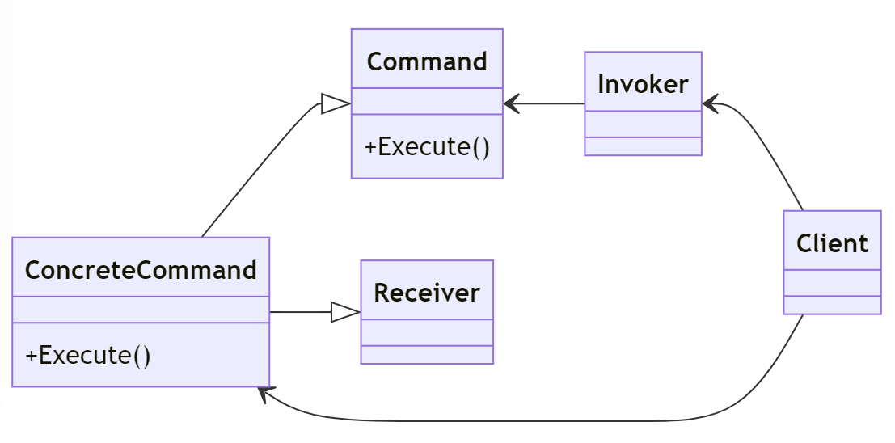

# Command Design Pattern

---

## Introduktion

Command-mönstret används för att kapsla in en begäran som ett objekt, vilket möjliggör parametrisering av klienter med olika begäranden, köa eller logga begäranden, och stöd för ångra operationer.

---

## Användningsområden

- När du behöver parametrera objekt med operationer.
- När du vill köa operationer för att utföras senare.
- När du behöver stöd för ångra och gör om funktionalitet.

---

## Struktur



---

## Komponenter

- **Command**: Definierar ett gränssnitt för att utföra en operation.
- **ConcreteCommand**: Implementerar `Command`-gränssnittet och definierar kopplingen mellan mottagare och en operation.
- **Invoker**: Ber om en operation att utföras.
- **Receiver**: Utför en operation.

---

## Exempel: Lampkontroll

Vi ska skapa ett exempel där vi använder Command-mönstret för att kontrollera en lampa. Vi kommer att ha kommandon för att tända och släcka lampan.

---

## Command Interface

Först definierar vi ett gränssnitt för kommandon:

```csharp
public interface ICommand
{
    void Execute();
}
```

---

## ConcreteCommand: TurnOnCommand

Vi skapar en konkret klass för att tända lampan:

```csharp
public class TurnOnCommand : ICommand
{
    private Lamp _lamp;

    public TurnOnCommand(Lamp lamp)
    {
        _lamp = lamp;
    }

    public void Execute()
    {
        _lamp.TurnOn();
    }
}
```

---

## ConcreteCommand: TurnOffCommand

Vi skapar en konkret klass för att släcka lampan:

```csharp
public class TurnOffCommand : ICommand
{
    private Lamp _lamp;

    public TurnOffCommand(Lamp lamp)
    {
        _lamp = lamp;
    }

    public void Execute()
    {
        _lamp.TurnOff();
    }
}
```

---

## Lamp Class (Receiver)

Vi skapar en klass för lampan som ska utföra kommandona:

```csharp
public class Lamp
{
    public void TurnOn()
    {
        Console.WriteLine("Lamp is On");
    }

    public void TurnOff()
    {
        Console.WriteLine("Lamp is Off");
    }
}
```

---

## Invoker

Vi skapar en invoker-klass som ber om kommandon att utföras:

```csharp
public class RemoteControl
{
    private ICommand _command;

    public void SetCommand(ICommand command)
    {
        _command = command;
    }

    public void PressButton()
    {
        _command.Execute();
    }
}
```

---

## Användningsexempel

Nu ska vi sätta ihop allt och se hur det fungerar:

```csharp
class Program
{
    static void Main(string[] args)
    {
        Lamp lamp = new Lamp();
        ICommand turnOn = new TurnOnCommand(lamp);
        ICommand turnOff = new TurnOffCommand(lamp);

        RemoteControl remote = new RemoteControl();

        remote.SetCommand(turnOn);
        remote.PressButton();

        remote.SetCommand(turnOff);
        remote.PressButton();
    }
}
```

---

## Förklaringar till koden

1. **Lamp (Receiver)**: Objektet som utför faktiska åtgärder, tända och släcka lampan.
2. **ICommand (Command)**: Gränssnittet som definierar `Execute`-metoden.
3. **TurnOnCommand och TurnOffCommand (ConcreteCommand)**: Implementerar `ICommand` och specificerar hur lampan ska tändas eller släckas.
4. **RemoteControl (Invoker)**: Ber om att utföra ett kommando genom att kalla på `Execute`-metoden.

---

## Fördelar med Command Pattern

- **Lösgör Avsändare och Mottagare**: Avsändaren behöver inte känna till detaljerna om mottagaren av en begäran.
- **Lätt att utöka**: Nya kommandon kan enkelt läggas till utan att ändra befintlig kod.
- **Stöd för Ångra och Gör om**: Kan enkelt implementera ångra/gör om funktionalitet genom att hålla en historik av kommandon.
- **Köa och Logga**: Kommandon kan köas och loggas för senare användning.
- **Flexibilitet**: Ger flexibilitet att parametrisera objekt med operationer.

---
## Fördelar med Command Pattern

- **Enkel att testa**: Lätt att testa kommandon separat.
- **Lätt att förstå**: Ökar läsbarheten genom att separera kommandon från avsändare och mottagare.
- **Återanvändning**: Kommandon kan återanvändas i olika sammanhang.
- **Lätt att implementera**: Enkel att implementera och förstå.
- **Lätt att underhålla**: Lätt att underhålla och ändra kommandon.
- **Skalbarhet**: Ger möjlighet att skala upp och hantera stora system.
---

## Jämförelse med Direkt Metodanrop

Låt oss jämföra Command-mönstret med direkt metodanrop.

### Direkt Metodanrop

```csharp
class Program
{
    static void Main(string[] args)
    {
        Lamp lamp = new Lamp();
        lamp.TurnOn();
        lamp.TurnOff();
    }
}
```

---

## Problem med Direkt Metodanrop

- **Hård koppling**: Klienten måste känna till exakt vilken metod som ska anropas på mottagaren.
- **Ingen flexibilitet**: Svårt att ändra logiken för hur kommandon ska utföras utan att ändra klientkoden.

---

## Sammanfattning

Command-mönstret kapslar in en begäran som ett objekt, vilket gör det möjligt att parametrera klienter med olika begäranden, köa eller logga begäranden och stöd för ångra operationer. Det lösgör avsändaren och mottagaren av en begäran och ger flexibilitet och utbyggbarhet.

