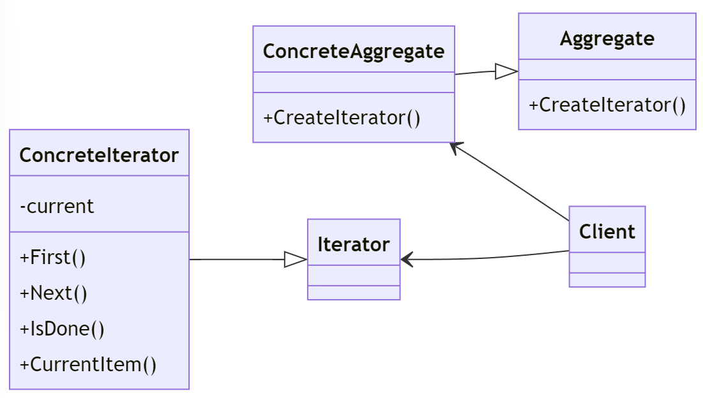

# Iterator Design Pattern

---

## Introduktion

Iterator-mönstret används för att sekventiellt komma åt elementen i en samling utan att avslöja den underliggande representationen. Ungefär som när läser en bok, så fungerar iteratorn som ett bokmärke som håller reda på var du är i boken.

Detta mönster finns i .NET Framework i form av `IEnumerator` och `IEnumerable`-gränssnitten.

---

## Användningsområden

- När du vill ge ett standardiserat sätt att komma åt elementen i en samling.
- När du behöver stöd för flera traverseringsmetoder genom en samling.
- När du vill separera traverseringslogiken från samlingen.

---

## Struktur



---

## Komponenter

- **Iterator**: Definierar ett gränssnitt för att komma åt och traversera elementen.
- **ConcreteIterator**: Implementerar `Iterator`-gränssnittet och håller reda på den aktuella positionen i traverseringen.
- **Aggregate**: Definierar ett gränssnitt för att skapa en iterator.
- **ConcreteAggregate**: Implementerar `Aggregate`-gränssnittet och returnerar en konkret iterator.

---

## Exempel: Boklista

Vi ska skapa ett exempel där vi använder Iterator-mönstret för att traversera en lista med böcker.

---

## Iterator Interface

Först definierar vi ett gränssnitt för iteratorn:

```csharp
public interface IIterator<T>
{
    T First();
    T Next();
    bool IsDone();
    T CurrentItem();
}
```

---

## ConcreteIterator

Vi skapar en konkret iterator som håller reda på positionen i boklistan:

```csharp
public class BookIterator : IIterator<Book>
{
    private BookCollection _collection;
    private int _current = 0;

    public BookIterator(BookCollection collection)
    {
        _collection = collection;
    }
```

---

```csharp
    public Book First()
    {
        _current = 0;
        return _collection[_current];
    }
}
```

---

```csharp
public Book Next()
{
    _current++;
    if (!IsDone())
    {
        return _collection[_current];
    }
    else
    {
        return null;
    }
}
```

---

```csharp
public bool IsDone()
{
    return _current >= _collection.Count;
}
```

---

```csharp
public Book CurrentItem()
{
    if (!IsDone())
    {
        return _collection[_current];
    }
    else
    {
        return null;
    }
}
```

---

## Aggregate Interface

Vi definierar ett gränssnitt för samlingen:

```csharp
public interface IAggregate<T>
{
    IIterator<T> CreateIterator();
}
```

---

## ConcreteAggregate

Vi skapar en konkret samling av böcker:

```csharp
public class BookCollection : IAggregate<Book>
{
    private List<Book> _books = new List<Book>();

    public IIterator<Book> CreateIterator()
    {
        return new BookIterator(this);
    }
}
```

---

```csharp
public int Count
{
    get { return _books.Count; }
}

public void AddBook(Book book)
{
    _books.Add(book);
}
```

---

```csharp
public Book this[int index]
{
    get { return _books[index]; }
}
```

---

## Book Class

Vi skapar en enkel bokklass för att representera böckerna i vår samling:

```csharp
public class Book
{
    public string Title { get; set; }

    public Book(string title)
    {
        Title = title;
    }
}
```

---

## Användningsexempel

Nu ska vi sätta ihop allt och se hur det fungerar:

```csharp
class Program
{
    static void Main(string[] args)
    {
        BookCollection books = new BookCollection();
        books.AddBook(new Book("Book 1"));
        books.AddBook(new Book("Book 2"));
        books.AddBook(new Book("Book 3"));

```

---

## Användningsexempel (fortsättning)

```csharp
        IIterator<Book> iterator = books.CreateIterator();
        for (Book book = iterator.First(); !iterator.IsDone(); book = iterator.Next())
        {
            Console.WriteLine(book.Title);
        }
}
}
```

---

## Förklaringar till koden

1. **Book (Element)**: Klassen som representerar objekt i samlingen.
2. **IIterator (Iterator)**: Gränssnittet som definierar metoderna för att traversera samlingen.
3. **BookIterator (ConcreteIterator)**: Implementerar `IIterator` och håller reda på den aktuella positionen i traverseringen.
4. **IAggregate (Aggregate)**: Gränssnittet som definierar metoden för att skapa en iterator.
5. **BookCollection (ConcreteAggregate)**: Implementerar `IAggregate` och returnerar en konkret iterator.

---

## Fördelar med Iterator Pattern

- **Enkel åtkomst**: Ger ett standardiserat sätt att komma åt elementen i en samling utan att avslöja dess underliggande representation.
- **Flexibilitet**: Kan enkelt ändra traverseringslogiken utan att påverka samlingen.
- **Separation av ansvarsområden**: Separera traverseringslogiken från samlingslogiken.

---

## Jämförelse med Liknande Mönster

### Jämförelse med For-Each Loop

- **Iterator**: Ger mer kontroll över traverseringen och tillåter anpassade traverseringsalgoritmer.
- **For-Each Loop**: Mindre flexibel, men enklare att använda för grundläggande iteration.

### Jämförelse med Composite Pattern

- **Iterator**: Används för att traversera en samling utan att avslöja dess underliggande representation.
- **Composite**: Används för att hantera en samling av objekt som ett enda objekt.

---

## Sammanfattning

Iterator-mönstret tillhandahåller ett standardiserat sätt att sekventiellt komma åt elementen i en samling utan att avslöja den underliggande representationen. Det erbjuder enkel åtkomst, flexibilitet och separation av ansvarsområden.