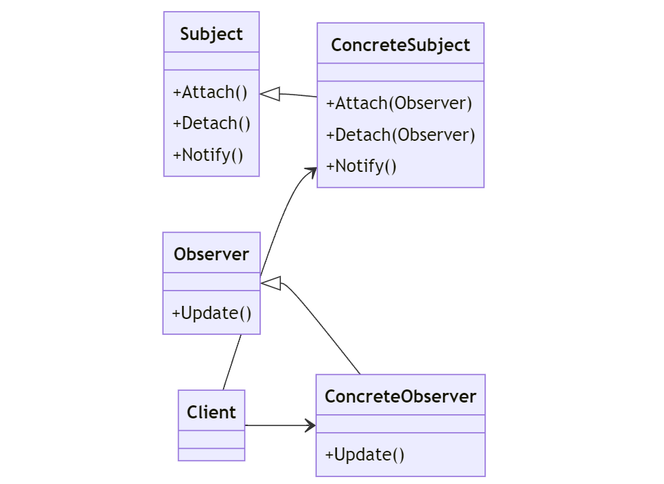

# Observer Design Pattern

---

## Introduktion

Observer-mönstret används för att skapa en prenumerationsmodell där objekt kan prenumerera på och bli notifierade om händelser i ett annat objekt. Det är användbart för att implementera distributerade händelsehanteringssystem.

---

## Användningsområden

- När objekt ska notifieras om ändringar i ett annat objekt utan att hårdkoppla dem.
- När du behöver skapa en lös koppling mellan objekt.
- När du vill att flera objekt ska reagera på förändringar i ett objekt.

---

## Struktur



---

## Komponenter

- **Subject**: Abstrakt klass som innehåller en lista över observers och metoder för att lägga till, ta bort och notifiera observers.
- **ConcreteSubject**: Implementerar `Subject` och håller det tillstånd som observers är intresserade av.
- **Observer**: Abstrakt klass som definierar metoden `Update`, vilken anropas för att notifiera observern om ändringar i subjektet.
- **ConcreteObserver**: Implementerar `Observer` och uppdaterar sitt tillstånd i enlighet med subjektet.

---

## Exempel: Score Table

Vi ska skapa ett exempel där vi använder Observer-mönstret för att notifiera när en ny high score uppnås i en score table.

---

## Subject Interface

Först definierar vi ett gränssnitt för subjektet:

```csharp
public interface ISubject
{
    void Attach(IObserver observer);
    void Detach(IObserver observer);
    void Notify();
}
```

---

## ConcreteSubject

Vi skapar ett konkret subjekt som håller reda på high scores:

```csharp
public class ScoreBoard : ISubject
{
    private List<IObserver> _observers = new List<IObserver>();
    private int _highScore;

    public int HighScore
    {
        get { return _highScore; }
        set
        {
            if (value > _highScore)
            {
                _highScore = value;
                Notify();
            }
        }
    }
```

---

```csharp
    public void Attach(IObserver observer)
    {
        _observers.Add(observer);
    }

    public void Detach(IObserver observer)
    {
        _observers.Remove(observer);
    }

    public void Notify()
    {
        foreach (var observer in _observers)
        {
            observer.Update();
        }
    }
}
```

---

## Observer Interface

Vi definierar ett gränssnitt för observers:

```csharp
public interface IObserver
{
    void Update();
}
```

---

## ConcreteObserver

Vi skapar en konkret observer som reagerar på high score-ändringar:

```csharp
public class HighScoreDisplay : IObserver
{
    private ScoreBoard _scoreBoard;

    public HighScoreDisplay(ScoreBoard scoreBoard)
    {
        _scoreBoard = scoreBoard;
        _scoreBoard.Attach(this);
    }

    public void Update()
    {
        Console.WriteLine($"New high score: {_scoreBoard.HighScore}");
    }
}
```

---

## Användningsexempel

Nu ska vi sätta ihop allt och se hur det fungerar:

```csharp
class Program
{
    static void Main(string[] args)
    {
        ScoreBoard scoreBoard = new ScoreBoard();
        HighScoreDisplay highScoreDisplay = new HighScoreDisplay(scoreBoard);

        scoreBoard.HighScore = 100; // New high score: 100
        scoreBoard.HighScore = 200; // New high score: 200
        scoreBoard.HighScore = 150; //
    }
}
```

---

## Förklaringar till koden

1. **ISubject (Subject)**: Gränssnittet som definierar metoderna för att lägga till, ta bort och notifiera observers.
2. **ScoreBoard (ConcreteSubject)**: Implementerar `ISubject` och håller reda på high scores.
3. **IObserver (Observer)**: Gränssnittet som definierar metoden `Update`.
4. **HighScoreDisplay (ConcreteObserver)**: Implementerar `IObserver` och reagerar på high score-ändringar genom att visa det nya high score.

---

## Fördelar med Observer Pattern

- **Lös koppling**: Subjektet och observerna är löst kopplade, vilket gör det enkelt att lägga till och ta bort observers.
- **Dynamiska relationer**: Observermönstret stöder dynamiska relationer mellan subjekt och observers, vilket gör det flexibelt och skalbart.

---

## Jämförelse med Events

Låt oss jämföra Observer-mönstret med händelsehantering med events i C#.

### Händelsehantering med Events

I C# kan vi använda events för att implementera liknande funktionalitet.

---

## Subject med Event

Vi skapar ett konkret subjekt som använder events:

```csharp
public class ScoreBoard
{
    public event Action<int> HighScoreChanged;
    private int _highScore;

    public int HighScore
    {
        get { return _highScore; }
        set
        {
            if (value > _highScore)
            {
                _highScore = value;
                HighScoreChanged?.Invoke(_highScore);
            }
        }
    }
}
```

---

## Observer med Event

Vi skapar en observer som prenumererar på eventet:

```csharp
public class HighScoreDisplay
{
    public HighScoreDisplay(ScoreBoard scoreBoard)
    {
        scoreBoard.HighScoreChanged += OnHighScoreChanged;
    }

    private void OnHighScoreChanged(int newHighScore)
    {
        Console.WriteLine($"New high score: {newHighScore}");
    }
}
```

---

## Användningsexempel med Event

```csharp
class Program
{
    static void Main(string[] args)
    {
        ScoreBoard scoreBoard = new ScoreBoard();
        HighScoreDisplay highScoreDisplay = new HighScoreDisplay(scoreBoard);

        scoreBoard.HighScore = 100;
        scoreBoard.HighScore = 200;
        scoreBoard.HighScore = 150;
    }
}
```

---

## Jämförelse

### Observer Pattern

- **Flexibilitet**: Möjlighet att enkelt lägga till och ta bort observers.
- **Mönsterbaserat**: Följer ett välkänt designmönster, vilket kan vara fördelaktigt i komplexa system.

### Events

- **Enkelhet**: Inbyggd stöd i C#, vilket gör det enkelt att använda.
- **Prestanda**: Kan ha lägre prestandaöverhead jämfört med att implementera ett eget observermönster.

---

## Sammanfattning

Observer-mönstret och händelsehantering med events ger båda möjligheten att notifiera objekt om ändringar i andra objekt. Observer-mönstret erbjuder större flexibilitet och följer ett välkänt designmönster, medan events i C# ger en enkel och effektiv lösning för många scenarier.

