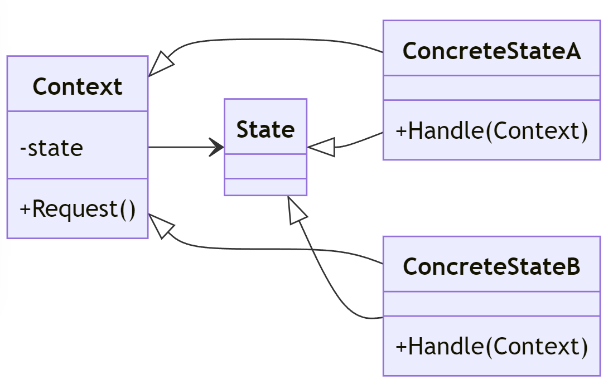

# State Design Pattern

---

## Introduktion

State-mönstret används för att tillåta ett objekt att ändra sitt beteende när dess interna tillstånd ändras. Objektet verkar ändra sin klass.

---

## Användningsområden

- När objektets beteende beroende av dess tillstånd.
- När du behöver hantera tillståndsövergångar explicit i kod.
- När du vill undvika många if-else eller switch-satser för att hantera tillstånd.

---

## Struktur



---

## Komponenter

- **State**: Definierar ett gränssnitt för att hantera ett tillstånd.
- **ConcreteState**: Implementerar specifikt beteende för ett tillstånd.
- **Context**: Innehåller ett tillståndsobjekt och delegerar begäran till det aktuella tillståndet.

---

## Exempel: Trafikljus

Vi ska skapa ett exempel där vi använder State-mönstret för att representera olika tillstånd i ett trafikljus (grönt, gult, rött).

---

## State Interface

Först definierar vi ett gränssnitt för tillstånden:

```csharp
public interface ITrafficLightState
{
    void Handle(TrafficLightContext context);
}
```

---

## ConcreteState: GreenState

Vi skapar ett konkret tillstånd för grönt ljus:

```csharp
public class GreenState : ITrafficLightState
{
    public void Handle(TrafficLightContext context)
    {
        Console.WriteLine("Green Light - Go");
        context.SetState(new YellowState());
    }
}
```

---

## ConcreteState: YellowState

Vi skapar ett konkret tillstånd för gult ljus:

```csharp
public class YellowState : ITrafficLightState
{
    public void Handle(TrafficLightContext context)
    {
        Console.WriteLine("Yellow Light - Slow Down");
        context.SetState(new RedState());
    }
}
```

---

## ConcreteState: RedState

Vi skapar ett konkret tillstånd för rött ljus:

```csharp
public class RedState : ITrafficLightState
{
    public void Handle(TrafficLightContext context)
    {
        Console.WriteLine("Red Light - Stop");
        context.SetState(new GreenState());
    }
}
```

---

## Context Class

Vi skapar en kontextklass som håller reda på det aktuella tillståndet:

```csharp
public class TrafficLightContext
{
    private ITrafficLightState _state;

    public TrafficLightContext(ITrafficLightState state)
    {
        _state = state;
    }

    public void SetState(ITrafficLightState state)
    {
        _state = state;
    }

```

---

```csharp	
    public void Request()
    {
        _state.Handle(this);
    }
}
```

---

## Användningsexempel

Nu ska vi sätta ihop allt och se hur det fungerar:

```csharp
class Program
{
    static void Main(string[] args)
    {
        TrafficLightContext context = new TrafficLightContext(new GreenState());

        context.Request(); // Green Light - Go
        context.Request(); // Yellow Light - Slow Down
        context.Request(); // Red Light - Stop
        context.Request(); // Green Light - Go
    }
}
```

---

## Förklaringar till koden

1. **ITrafficLightState (State)**: Gränssnittet som definierar metoden för att hantera ett tillstånd.
2. **GreenState, YellowState, RedState (ConcreteState)**: Implementerar `ITrafficLightState` och hanterar specifikt beteende för varje tillstånd.
3. **TrafficLightContext (Context)**: Håller reda på det aktuella tillståndet och delegerar begäran till det aktuella tillståndet.

---

## Fördelar med State Pattern

- **Lösgör tillstånd och beteende**: Separera tillstånd och beteende i olika klasser, vilket gör koden lättare att underhålla och utöka.
- **Tydliga tillståndsövergångar**: Hanterar tillståndsövergångar explicit i kod, vilket gör dem lättare att förstå och följa.
- **Flexibilitet**: Lägg till nya tillstånd utan att ändra befintlig kod.

---

## Jämförelse med Switch-satser

Låt oss jämföra State-mönstret med att använda switch-satser för att hantera tillstånd.

### Switch-sats

```csharp
public class TrafficLight
{
    private string _state = "Green";

    public void Request()
    {
        switch (_state)
        {
```

---


I första skedet är tillståndet grönt och vi ändrar tillståndet till gult:
Vi talar alltså om vad nästa steg blir.

```csharp
            case "Green":
                Console.WriteLine("Green Light - Go");
                _state = "Yellow";
                break;
```

---

I Yellow ser vi till att informera om det, och sedan ändra tillståndet till rött, så man vet vad som kommer härnäst.

```csharp
            case "Yellow":
                Console.WriteLine("Yellow Light - Slow Down");
                _state = "Red";
                break;
```

---

Slutligen röd, där vi informerar om att den ska stanna, och sedan ändrar tillståndet till grönt. Så att loopen börjar om.

```csharp
            case "Red":
                Console.WriteLine("Red Light - Stop");
                _state = "Green";
                break;
        }
    }
}
```

---

## Problem med Switch-sats

- **Svårt att underhålla**: Alla tillstånd och övergångar är samlade i en metod, vilket kan göra koden svår att underhålla och utöka.
- **Ingen separation av ansvar**: Ingen tydlig separation mellan olika tillstånd och deras beteenden.

---

## State Pattern som Lösning

State-mönstret löser dessa problem genom att separera tillstånd och beteenden i olika klasser och hantera övergångar explicit.

---

## Andra exempel

- Om vi skapar en liten avatar kan vi sätta olika känslolägen på den beroende på situationer, genom state-mönstret. 
- Vi kan även spara olika tillstånd i en spelapplikation, som att spara spelet, ladda spelet, starta spelet, etc.
- Vi kan även använda state-mönstret för att hantera olika tillstånd i en beställningsprocess, som att skapa, skicka, leverera, etc.

--- 

## Sammanfattning

State-mönstret tillåter ett objekt att ändra sitt beteende när dess interna tillstånd ändras. Genom att separera tillstånd och beteenden i olika klasser och hantera övergångar explicit, gör mönstret koden mer underhållbar och flexibel.
