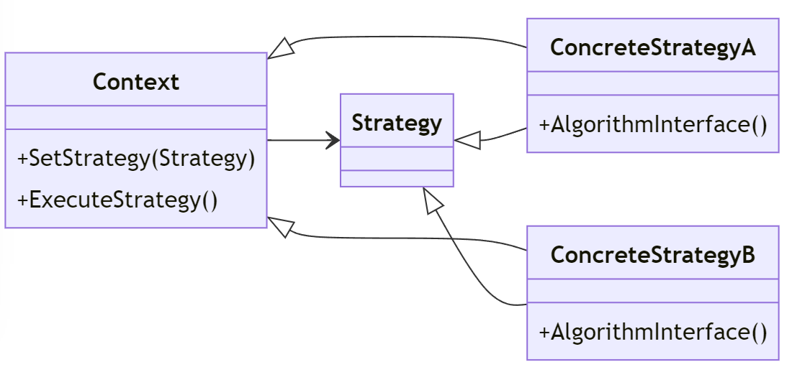

# Strategy Design Pattern

---

## Introduktion

Strategy-mönstret används för att definiera en familj av algoritmer, kapsla in dem och göra dem utbytbara. Det tillåter att algoritmerna varierar oberoende av klienter som använder dem.

---

## Användningsområden

- När du har flera relaterade algoritmer och vill kunna växla mellan dem.
- När du vill undvika att använda flera if-else eller switch-satser för att välja en algoritm.
- När du vill isolera och göra algoritmerna utbytbara.

---

## Struktur



---

## Komponenter

- **Strategy**: Definierar ett gränssnitt för en algoritm.
- **ConcreteStrategy**: Implementerar strategigränssnittet med en specifik algoritm.
- **Context**: Använder en strategi för att utföra en specifik algoritm.

---

## Exempel: Betalningssystem

Vi ska skapa ett exempel där vi använder Strategy-mönstret för att implementera olika betalningsmetoder (kreditkort, PayPal).

---

## Strategy Interface

Först definierar vi ett gränssnitt för strategin:

```csharp
public interface IPaymentStrategy
{
    void Pay(int amount);
}
```

---

## ConcreteStrategy: CreditCardStrategy

Vi skapar en konkret strategi för betalning med kreditkort:

```csharp
public class CreditCardStrategy : IPaymentStrategy
{
    private string _cardNumber;
    private string _cvv;
    private string _expiryDate;

    public CreditCardStrategy(string cardNumber, string cvv, string expiryDate)
    {
        _cardNumber = cardNumber;
        _cvv = cvv;
        _expiryDate = expiryDate;
    }
```

---

```csharp
    public void Pay(int amount)
    {
        Console.WriteLine($"Paid {amount} using Credit Card.");
    }
}
```

---

## ConcreteStrategy: PayPalStrategy

Vi skapar en konkret strategi för betalning med PayPal:

```csharp
public class PayPalStrategy : IPaymentStrategy
{
    private string _email;
    private string _password;

    public PayPalStrategy(string email, string password)
    {
        _email = email;
        _password = password;
    }
```

---

```csharp
    public void Pay(int amount)
    {
        Console.WriteLine($"Paid {amount} using PayPal.");
    }
}
```

---

## Context Class

Vi skapar en kontextklass som använder en betalningsstrategi:

```csharp
public class ShoppingCart
{
    private IPaymentStrategy _paymentStrategy;

    public void SetPaymentStrategy(IPaymentStrategy paymentStrategy)
    {
        _paymentStrategy = paymentStrategy;
    }

```

---

```csharp	
    public void Checkout(int amount)
    {
        _paymentStrategy.Pay(amount);
    }
}
```

---

## Användningsexempel

Nu ska vi sätta ihop allt och se hur det fungerar:

```csharp
class Program
{
    static void Main(string[] args)
    {
        ShoppingCart cart = new ShoppingCart();

        cart.SetPaymentStrategy(new CreditCardStrategy("1234-5678-9012-3456", "123", "12/23"));
        cart.Checkout(100);

        cart.SetPaymentStrategy(new PayPalStrategy("email@example.com", "password"));
        cart.Checkout(200);
    }
}
```

---

## Förklaringar till koden

1. **IPaymentStrategy (Strategy)**: Gränssnittet som definierar metoden för att utföra en betalning.
2. **CreditCardStrategy, PayPalStrategy (ConcreteStrategy)**: Implementerar `IPaymentStrategy` och utför specifika betalningsmetoder.
3. **ShoppingCart (Context)**: Håller en referens till en strategi och använder den för att utföra betalningar.

---

## Fördelar med Strategy Pattern

- **Enkel utbyggbarhet**: Lägg till nya strategier utan att ändra befintlig kod.
- **Flexibilitet**: Växla mellan olika algoritmer vid körning.
- **Isolering av kod**: Håll olika algoritmer separerade och enkla att underhålla.

---

## Jämförelse med If-Else

Låt oss jämföra Strategy-mönstret med att använda if-else-satser för att välja en algoritm.

### If-Else

```csharp
public class ShoppingCart
{
    private string _paymentMethod;

    public ShoppingCart(string paymentMethod)
    {
        _paymentMethod = paymentMethod;
    }
```

---

```csharp
    public void Checkout(int amount)
    {
        if (_paymentMethod == "CreditCard")
        {
            Console.WriteLine($"Paid {amount} using Credit Card.");
        }
```

---

```csharp
        else if (_paymentMethod == "PayPal")
        {
            Console.WriteLine($"Paid {amount} using PayPal.");
        }
    }
}
```

---

## Problem med If-Else

- **Svårt att underhålla**: Alla algoritmer och deras val finns i samma metod, vilket gör koden svår att underhålla och utöka.
- **Ingen separation av ansvar**: Ingen tydlig separation mellan olika algoritmer.

---

## Strategy Pattern som Lösning

Strategy-mönstret löser dessa problem genom att separera algoritmerna i olika klasser och välja dem dynamiskt.

---

## Sammanfattning

Strategy-mönstret tillåter att definiera en familj av algoritmer, kapsla in dem och göra dem utbytbara. Genom att separera algoritmerna i olika klasser och välja dem dynamiskt, gör mönstret koden mer underhållbar och flexibel.

På detta sätt kan vi separera olika algoritmer och göra dem utbytbara utan att ändra befintlig kod. Vi kan även fylla på med algoritmerna utan att ändra koden.