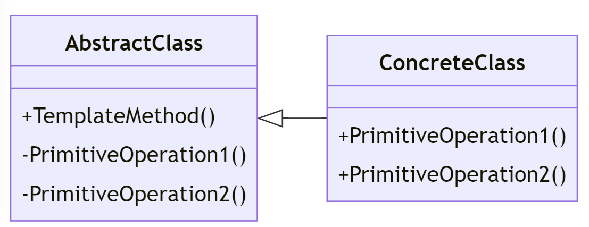

# Template Method Design Pattern

---

## Introduktion

Template Method-mönstret används för att definiera skelettet av en algoritm i en metod och låta subklasser överrida vissa steg i algoritmen utan att ändra dess struktur.

---

## Användningsområden

- När du vill låta subklasser definiera vissa steg i en algoritm utan att ändra dess struktur.
- När du vill återanvända gemensam kod i flera relaterade klasser.
- När du vill följa "Don't Repeat Yourself" (DRY) principen.
- Är kompatibel med Open/Closed Principle.
- Är kompatibel med strategimönstret.
- Du kan byr

---

## Struktur



---

## Komponenter

- **AbstractClass**: Definierar en Template Method som innehåller skelettet för en algoritm och en eller flera primitiva operationer som kan överridas av subklasser.
- **ConcreteClass**: Implementerar de primitiva operationerna för att komplettera algoritmen.

---

## Exempel: Sorteringsalgoritmer

Vi ska skapa ett exempel där vi använder Template Method-mönstret för att implementera tre olika sorteringsalgoritmer: Bubble Sort, Quick Sort och Insertion Sort.

---

## AbstractClass

Först definierar vi en abstrakt klass som innehåller skelettet för sorteringsalgoritmen:

```csharp
public abstract class Sorter
{
    public void Sort(int[] array)
    {
        if (array == null || array.Length == 0)
        {
            return;
        }
        PerformSort(array);
    }
    protected abstract void PerformSort(int[] array);
}
```

---

## ConcreteClass: BubbleSort

Vi skapar en konkret klass för Bubble Sort:

```csharp
public class BubbleSort : Sorter
{
    protected override void PerformSort(int[] array)
    {
        for (int i = 0; i < array.Length - 1; i++)
        {
            for (int j = 0; j < array.Length - i - 1; j++)
            {
```

---

```csharp
                if (array[j] > array[j + 1])
                {
                    int temp = array[j];
                    array[j] = array[j + 1];
                    array[j + 1] = temp;
                }
            }
        }
    }
}
```

---

## ConcreteClass: QuickSort

Vi skapar en konkret klass för Quick Sort:

```csharp
public class QuickSort : Sorter
{
    protected override void PerformSort(int[] array)
    {
        QuickSortRecursive(array, 0, array.Length - 1);
    }
```

---

```csharp
    private void QuickSortRecursive(int[] array, int low, int high)
    {
        if (low < high)
        {
            int pivotIndex = Partition(array, low, high);
            QuickSortRecursive(array, low, pivotIndex - 1);
            QuickSortRecursive(array, pivotIndex + 1, high);
        }
    }
```

---

```csharp
    private int Partition(int[] array, int low, int high)
    {
        int pivot = array[high];
        int i = low - 1;
```

---

```csharp
        for (int j = low; j < high; j++)
        {
            if (array[j] < pivot)
            {
                i++;
                int temp = array[i];
                array[i] = array[j];
                array[j] = temp;
            }
        }
```

---

```csharp
        int temp1 = array[i + 1];
        array[i + 1] = array[high];
        array[high] = temp1;

        return i + 1;
    }
}
```

---

## ConcreteClass: InsertionSort

Vi skapar en konkret klass för Insertion Sort:

```csharp
public class InsertionSort : Sorter
{
    protected override void PerformSort(int[] array)
    {
        for (int i = 1; i < array.Length; i++)
        {
            int key = array[i];
            int j = i - 1;
```

---

```csharp
            while (j >= 0 && array[j] > key)
            {
                array[j + 1] = array[j];
                j--;
            }

            array[j + 1] = key;
        }
    }
}
```

---

## Användningsexempel

Nu ska vi sätta ihop allt och se hur det fungerar:

```csharp
class Program
{
    static void Main(string[] args)
    {
        int[] array = { 34, 7, 23, 32, 5, 62 };
```

---

```csharp

        Sorter bubbleSort = new BubbleSort();
        bubbleSort.Sort(array);
        Console.WriteLine("Bubble Sort: " + string.Join(", ", array));
```

---

```csharp

        array = new int[] { 34, 7, 23, 32, 5, 62 };

        Sorter quickSort = new QuickSort();
        quickSort.Sort(array);
        Console.WriteLine("Quick Sort: " + string.Join(", ", array));
```

---

```csharp
        array = new int[] { 34, 7, 23, 32, 5, 62 };

        Sorter insertionSort = new InsertionSort();
        insertionSort.Sort(array);
        Console.WriteLine("Insertion Sort: " + string.Join(", ", array));
    }
}
```

---

## Förklaringar till koden

1. **Sorter (AbstractClass)**: Innehåller skelettet för sorteringsalgoritmen och definierar en abstrakt metod `PerformSort` som subklasser måste implementera.
2. **BubbleSort, QuickSort, InsertionSort (ConcreteClass)**: Implementerar `PerformSort` för respektive sorteringsalgoritm.

---

## Fördelar med Template Method Pattern

- **Återanvändning av kod**: Gemensam kod återanvänds i den abstrakta klassen, vilket minskar redundans.
- **Flexibilitet**: Subklasser kan anpassa delar av algoritmen utan att ändra dess struktur.
- **Enkelt underhåll**: Algoritmens struktur är centraliserad i en abstrakt klass, vilket gör den lättare att underhålla.

---

## Jämförelse med Manuell Implementering

Låt oss jämföra Template Method-mönstret med en manuell implementering utan mönstret.

### Manuell Implementering

```csharp
public class Sorter
{
    public void BubbleSort(int[] array)
    {        // massor med kod
    }

    public void QuickSort(int[] array)
    {   // massor med kod
    }
    private int Partition(int[] array, int low, int high)
    {   // massor med kod
    }

    public void InsertionSort(int[] array)
    {   // massor med kod
    }
}
```

---

## Problem med Manuell Implementering

- **Redundans**: Samma kod för att kontrollera och förbereda sorteringen upprepas i varje metod.
- **Svårt att underhålla**: Ändringar i sorteringsprocessen måste göras på flera ställen.
- **Svårt att utöka**: Att lägga till en ny sorteringsalgoritm kräver att du ändrar den befintliga koden.
- **Brott mot Open/Closed Principle**: Klassen är öppen för ändringar och inte stängd för utökningar.

---

## Template Method som Lösning

Template Method-mönstret löser dessa problem genom att centralisera gemensam kod i en abstrakt klass och låta subklasser överrida specifika steg.

---

## Sammanfattning

Template Method-mönstret definierar skelettet av en algoritm i en metod och låter subklasser överrida specifika steg utan att ändra dess struktur. Det främjar återanvändning av kod och gör algoritmer lättare att underhålla och utöka.
