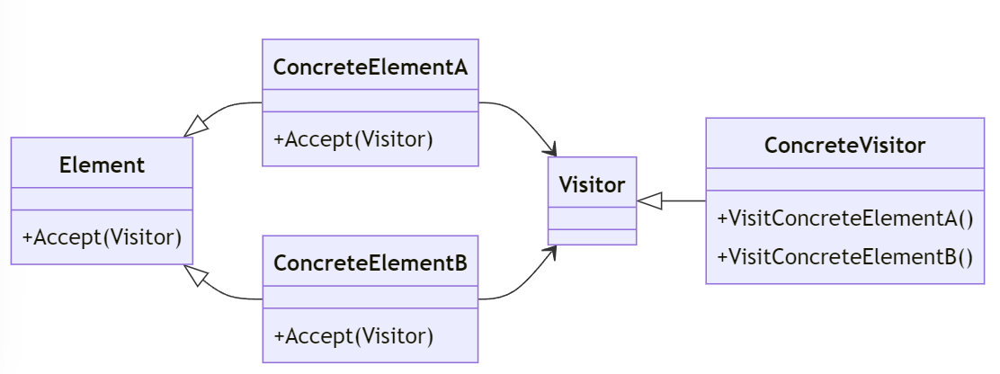

# Visitor Design Pattern

---

## Introduktion

Visitor-mönstret används för att separera algoritmer från objektstrukturen de verkar på. Det tillåter att nya operationer läggs till existerande objektstrukturer utan att ändra koden för dessa objekt.

---

## Användningsområden

- När du behöver utföra operationer på en samling av relaterade objekt av olika klasser.
- När du vill lägga till nya operationer till objektstrukturer utan att ändra deras kod.
- När du vill separera algoritmer från objektstrukturerna de verkar på.

---

## Struktur



---

## Komponenter

- **Visitor**: Definierar ett gränssnitt för besöksoperationer för varje typ av element i objektstrukturen.
- **ConcreteVisitor**: Implementerar besöksoperationerna för varje typ av element i objektstrukturen.
- **Element**: Definierar ett gränssnitt för att acceptera besökaren.
- **ConcreteElement**: Implementerar `Element` och accepterar en besökare.

---

## Exempel: Filer och Mappar

Vi ska skapa ett exempel där vi använder Visitor-mönstret för att utföra operationer på en objektstruktur av filer och mappar.

---

## Element Interface

Först definierar vi ett gränssnitt för elementen:

```csharp
public interface IFileSystemElement
{
    void Accept(IVisitor visitor);
}
```

---

## ConcreteElement: File

Vi skapar en konkret klass för filer:

```csharp
public class File : IFileSystemElement
{
    public string Name { get; set; }
    public int Size { get; set; }
    public File(string name, int size)
    {
        Name = name;
        Size = size;
    }
    public void Accept(IVisitor visitor)
    {
        visitor.Visit(this);
    }
}
```

---

## ConcreteElement: Directory

Vi skapar en konkret klass för mappar:

```csharp
public class Directory : IFileSystemElement
{
    public string Name { get; set; }
    public List<IFileSystemElement> Elements { get; set; } = new List<IFileSystemElement>();

    public Directory(string name)
    {
        Name = name;
    }

    public void Accept(IVisitor visitor)
    {
        visitor.Visit(this);
    }
}
```

---

## Visitor Interface

Vi definierar ett gränssnitt för besökaren:

```csharp
public interface IVisitor
{
    void Visit(File file);
    void Visit(Directory directory);
}
```

---

## ConcreteVisitor: SizeVisitor

Vi skapar en konkret besökare som beräknar storleken på filer och mappar:

```csharp
public class SizeVisitor : IVisitor
{
    public int TotalSize { get; private set; }

    public void Visit(File file)
    {
        TotalSize += file.Size;
    }
```

---

```csharp
    public void Visit(Directory directory)
    {
        foreach (var element in directory.Elements)
        {
            element.Accept(this);
        }
    }
}
```

---

## ConcreteVisitor: NameVisitor

Vi skapar en konkret besökare som samlar namnen på alla filer och mappar:

```csharp
public class NameVisitor : IVisitor
{
    public List<string> Names { get; private set; } = new List<string>();

    public void Visit(File file)
    {
        Names.Add(file.Name);
    }
```

---

```csharp
    public void Visit(Directory directory)
    {
        Names.Add(directory.Name);
        foreach (var element in directory.Elements)
        {
            element.Accept(this);
        }
    }
}
```

---

## Användningsexempel

Nu ska vi sätta ihop allt och se hur det fungerar:

```csharp
class Program
{
    static void Main(string[] args)
    {
        var file1 = new File("File1.txt", 100);
        var file2 = new File("File2.txt", 200);
        var directory = new Directory("Folder1");
        directory.Elements.Add(file1);
        directory.Elements.Add(file2);

        var root = new Directory("Root");
        root.Elements.Add(directory);
        root.Elements.Add(new File("File3.txt", 300));
```

---

```csharp
        var sizeVisitor = new SizeVisitor();
        root.Accept(sizeVisitor);
        Console.WriteLine($"Total Size: {sizeVisitor.TotalSize}");

        var nameVisitor = new NameVisitor();
        root.Accept(nameVisitor);
        Console.WriteLine("Names: " + string.Join(", ", nameVisitor.Names));
    }
}
```

---

## Output:

```plaintext
Total Size: 600
Names: Root, Folder1, File1.txt, File2.txt, File3.txt
```

---

## Förklaringar till koden

1. **IFileSystemElement (Element)**: Gränssnittet som definierar metoden för att acceptera en besökare.
2. **File, Directory (ConcreteElement)**: Implementerar `IFileSystemElement` och accepterar en besökare.
3. **IVisitor (Visitor)**: Gränssnittet som definierar besöksoperationer för varje typ av element.
4. **SizeVisitor, NameVisitor (ConcreteVisitor)**: Implementerar besöksoperationerna för att beräkna storleken och samla namn.

---

## Fördelar med Visitor Pattern

- **Ökad flexibilitet**: Gör det enkelt att lägga till nya operationer utan att ändra objektstrukturen.
- **Enkelt att utöka**: Nya besökare kan läggas till utan att ändra befintlig kod.
- **Separering av algoritmer och strukturer**: Håller algoritmer separerade från objektstrukturerna de verkar på.

---

## Jämförelse med Direkt Implementering

Låt oss jämföra Visitor-mönstret med en direkt implementering där operationer implementeras direkt i objektstrukturen.

### Direkt Implementering

```csharp
public class File
{
    public string Name { get; set; }
    public int Size { get; set; }

    public File(string name, int size) { /* massor med kod */ }
    public int GetSize()  { /* massor med kod */ }
    public string GetName() 
}
```

---

```csharp
public class Directory
{
    public string Name { get; set; }
    public List<File> Files { get; set; } = new List<File>();
    public Directory(string name) { /* massor med kod */ }
    public int GetSize() { /* massor med kod */ }
    public List<string> GetNames() { /* massor med kod */
}
```

---

## Problem med Direkt Implementering

- **Svårt att utöka**: Att lägga till nya operationer kräver ändringar i objektstrukturen.
- **Ingen separering av ansvar**: Algoritmer och strukturer är tätt kopplade, vilket gör koden svår att underhålla och utöka.

---

## Visitor Pattern som Lösning

Visitor-mönstret löser dessa problem genom att separera algoritmerna från objektstrukturen.

---

## Sammanfattning

Visitor-mönstret tillåter att nya operationer läggs till objektstrukturer utan att ändra deras kod. Genom att separera algoritmer från strukturerna de verkar på, gör mönstret koden mer flexibel och utbyggbar.

